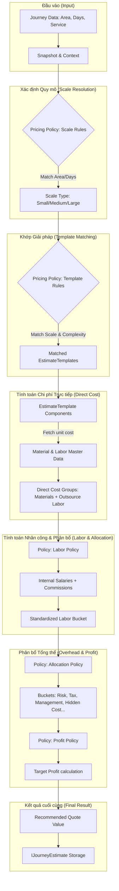

# Sơ đồ và Mô tả Logic Tính toán Dự toán Tự động (Step 04)

Tài liệu này mô tả chi tiết cách hệ thống tự động tính toán dự toán kỹ thuật dựa trên các Schema và Hợp đồng (Contracts) hiện có.

## 1. Các thành phần tham gia (Schemas/Contracts)

Hệ thống vận hành dựa trên sự phối hợp của 5 nhóm dữ liệu chính:

| Schema | Vai trò |
| :--- | :--- |
| **IJourney** | **Đầu vào khách hàng**: Diện tích (`area_m2`), Thời gian thi công (`execution_days`), Loại dịch vụ (`serviceTypeId`), Mức độ phức tạp. |
| **IEstimatePricingPolicy** | **Bộ não tính toán**: Chứa các quy tắc về thang quy mô (Scale), quy tắc chọn Template, chính sách nhân công, lợi nhuận và phân bổ chi phí gián tiếp. |
| **IEstimateTemplate** | **Mẫu giải pháp**: Định nghĩa các hạng mục vật tư/nhân công mẫu cho một gói công việc cụ thể. |
| **IMaterial / ILaborPriceConfig** | **Dữ liệu gốc**: Cung cấp đơn giá vật tư và đơn giá nhân công hiện hành. |
| **IJourneyEstimate** | **Kết quả đầu ra**: Lưu trữ toàn bộ snapshot, 9 nhóm chi phí tiêu chuẩn (Buckets), và bảng phân bổ nhân công. |

---

## 2. Sơ đồ luồng dữ liệu (Calculation Flow)

---

## 3. Các bước tính toán chi tiết

### Bước 1: Thu thập Snapshot
Hệ thống chụp lại trạng thái hiện tại của Journey (diện tích, ngày thi công) và gán mức độ phức tạp (Complexity Factor: Standard = 1.0, Difficult = 1.2, Very Difficult = 1.5).

### Bước 2: Xác định Quy mô (Scale)
Dựa trên `area_m2` và `execution_days`, hệ thống đối chiếu với `scale_rules` trong Policy để xác định công trình thuộc quy mô nào. Điều này ảnh hưởng trực tiếp đến việc chọn Template ở bước sau.

### Bước 3: Áp dụng Template mẫu
*   Hệ thống tìm các `EstimateTemplate` được gán trong `template_rules` của Policy mà thỏa mãn điều kiện Quy mô và Mức độ phức tạp.
*   Nếu không có Rule nào khớp, hệ thống sẽ tự động tìm 1 Template mặc định theo loại dịch vụ (`serviceTypeId`) có quy mô tương ứng.
*   Nếu vẫn không tìm thấy, hệ thống sử dụng logic **Fallback** (tính toán thô dựa trên đơn giá m2 cơ bản trong Policy).

### Bước 4: Tính toán Chi phí vật tư & nhân công mẫu
*   Với mỗi Template, hệ thống tính toán số lượng dựa trên công thức (`quantity_formula`) hoặc tỷ lệ nhân với diện tích/ngày công.
*   Đơn giá được lấy từ danh mục vật tư hoặc bảng giá nhân công hiện tại.

### Bước 5: Tính toán chi phí nhân công nội bộ & Hoa hồng
Dựa trên `labor_policy`:
*   **Lương nội bộ**: Tính theo (Lương tháng / Số ngày công chuẩn) x Số ngày thi công thực tế.
*   **Hoa hồng**: Tính theo tỷ lệ % trên tổng tiền vật tư cho Kỹ thuật và Giám sát.

### Bước 6: Phân bổ 9 Nhóm chi phí (Buckets)
Sử dụng `allocation_policy` để tính toán 9 nhóm chi phí tiêu chuẩn:
1.  **Vật tư**: Tổng từ các hạng mục.
2.  **Nhân công**: Tổng từ nhân công thầu phụ + lương nội bộ + hoa hồng.
3.  **Bảo hành & Bảo trì**: % trên giá trị hợp đồng/chi phí trực tiếp.
4.  **Dự phòng rủi ro**: % cấu hình.
5.  **Thuế doanh nghiệp**: % cấu hình.
6.  **Chi phí bán hàng**: % cấu hình.
7.  **Chi phí quản lý**: % cấu hình.
8.  **Chi phí ẩn**: % cấu hình.
9.  **Lợi nhuận**: Phần dư còn lại sau khi trừ toàn bộ chi phí trên khỏi Giá chào thầu.

### Bước 7: Đề xuất Giá chào thầu (Recommended Quote)
Giá đề xuất được tính bằng công thức:
`Giá đề xuất = Tổng chi phí trực tiếp / (1 - %Lợi nhuận mục tiêu)`
