# 🗂️ ENTITY RELATIONSHIP DIAGRAM (ERD) v2.0
**SIRA Service Management Platform**

---

## 1. THÔNG TIN TÀI LIỆU

| Item | Value |
|------|-------|
| **Version** | 2.0 |
| **Date** | 2026-02-12 |
| **Based On** | BRD v2.0, FDD v2.0 |
| **Changes from v1.0** | Thêm 7 bảng mới: OUTSOURCE_COMPANY, PAYMENT_MILESTONE, PAYMENT_TXN, PROJECT_SHARE_LINK, FILE_STORAGE, CHAT_ATTACHMENT, PROJECT_LABOR_COST |

---

## 2. NGUYÊN TẮC THIẾT KẾ

1. **Multi-tenant ready**: Tất cả bảng có `tenant_id`
2. **Audit trail**: Tất cả bảng có `created_at`, `updated_at`
3. **Soft delete**: Không xóa vật lý, dùng `is_deleted` flag
4. **Outsource support**: Phân biệt internal vs outsource users
5. **Payment tracking**: Track milestones chi tiết
6. **File management**: Tách riêng file storage, hỗ trợ Google Drive

---

## 3. ERD DIAGRAM (Mermaid)

```mermaid
erDiagram
  TENANT ||--o{ USER : has
  TENANT ||--o{ TEAM : has
  TENANT ||--o{ CUSTOMER : has
  TENANT ||--o{ CONTRACT : has
  TENANT ||--o{ PROJECT : has
  TENANT ||--o{ MATERIAL_CATALOG : has
  TENANT ||--o{ OUTSOURCE_COMPANY : has

  USER ||--o{ TEAM_MEMBER : joins
  TEAM ||--o{ TEAM_MEMBER : contains
  
  CUSTOMER ||--o{ CONTRACT : signs
  CONTRACT ||--o{ PROJECT : includes

  PROJECT ||--o{ PROJECT_ASSIGNMENT : has
  USER ||--o{ PROJECT_ASSIGNMENT : assigned

  PROJECT ||--o{ TASK : has
  USER ||--o{ TASK : assigned_to

  PROJECT ||--o{ EVIDENCE : has
  FILE_STORAGE ||--o{ EVIDENCE : stores
  USER ||--o{ EVIDENCE : uploads

  PROJECT ||--o{ CHAT_ROOM : has
  CHAT_ROOM ||--o{ CHAT_MESSAGE : contains
  USER ||--o{ CHAT_MESSAGE : sends
  CHAT_MESSAGE ||--o{ CHAT_ATTACHMENT : has
  FILE_STORAGE ||--o{ CHAT_ATTACHMENT : stores

  PROJECT ||--o{ MATERIAL_USAGE : consumes
  MATERIAL_CATALOG ||--o{ MATERIAL_USAGE : referenced
  USER ||--o{ MATERIAL_USAGE : recorded_by

  PROJECT ||--o{ PAYMENT_MILESTONE : has
  PAYMENT_MILESTONE ||--o{ PAYMENT_TXN : has
  USER ||--o{ PAYMENT_TXN : created_by

  PROJECT ||--o{ PROJECT_SHARE_LINK : has
  USER ||--o{ PROJECT_SHARE_LINK : created_by

  PROJECT ||--o{ PROJECT_LABOR_COST : has
  OUTSOURCE_COMPANY ||--o{ PROJECT_LABOR_COST : for_company

  PROJECT ||--o{ PROJECT_STATUS_LOG : changes
  USER ||--o{ PROJECT_STATUS_LOG : changed_by

  OUTSOURCE_COMPANY ||--o{ USER : employs
  OUTSOURCE_COMPANY ||--o{ PROJECT : executes

  TENANT {
    uuid id PK
    string name
    string code
    datetime created_at
  }

  USER {
    uuid id PK
    uuid tenant_id FK
    string user_type "INTERNAL|OUTSOURCE"
    uuid outsource_company_id FK "nullable"
    string username
    string full_name
    string phone
    string email
    string password_hash
    string role "ADMIN|PM|SUPERVISOR|ACCOUNTANT|OUTSOURCE_LEADER|STAFF"
    string status "ACTIVE|DISABLED"
    datetime created_at
    datetime updated_at
  }

  OUTSOURCE_COMPANY {
    uuid id PK
    uuid tenant_id FK
    string name
    string contact_person
    string phone
    string email
    string address
    string tax_code
    string payment_terms
    string status "ACTIVE|INACTIVE"
    datetime created_at
    datetime updated_at
  }

  TEAM {
    uuid id PK
    uuid tenant_id FK
    string name
    uuid leader_user_id FK
    string status "ACTIVE|ARCHIVED"
    datetime created_at
  }

  TEAM_MEMBER {
    uuid id PK
    uuid tenant_id FK
    uuid team_id FK
    uuid user_id FK
    string role_in_team "LEADER|MEMBER"
    datetime joined_at
  }

  CUSTOMER {
    uuid id PK
    uuid tenant_id FK
    string name
    string phone
    string email
    string address
    string tax_code
    text notes
    datetime created_at
    datetime updated_at
  }

  CONTRACT {
    uuid id PK
    uuid tenant_id FK
    uuid customer_id FK
    string contract_no
    string title
    decimal total_value
    string currency "VND"
    string status "DRAFT|ACTIVE|COMPLETED|CANCELLED"
    date signed_date
    date effective_from
    date effective_to
    string attachment_url
    datetime created_at
    datetime updated_at
  }

  PROJECT {
    uuid id PK
    uuid tenant_id FK
    uuid contract_id FK
    uuid customer_id FK
    uuid pm_id FK "PM assigned"
    uuid supervisor_id FK "nullable, for outsource projects"
    uuid outsource_company_id FK "nullable"
    string project_type "INTERNAL|OUTSOURCE"
    string code
    string name
    string address
    string geo_lat
    string geo_lng
    string waterproofing_type
    string status "DRAFT|SCHEDULED|IN_PROGRESS|AWAITING_APPROVAL|COMPLETED|CLOSED|CANCELLED"
    date plan_start
    date plan_end
    datetime created_at
    datetime updated_at
  }

  PROJECT_ASSIGNMENT {
    uuid id PK
    uuid tenant_id FK
    uuid project_id FK
    uuid user_id FK
    string role "PM|SUPERVISOR|OUTSOURCE_LEADER|STAFF"
    datetime assigned_at
  }

  TASK {
    uuid id PK
    uuid tenant_id FK
    uuid project_id FK
    uuid assigned_user_id FK
    string title
    text description
    string status "TODO|DOING|DONE|BLOCKED"
    datetime plan_start
    datetime plan_end
    datetime checkin_at
    datetime checkout_at
    datetime created_at
    datetime updated_at
  }

  FILE_STORAGE {
    uuid id PK
    uuid tenant_id FK
    uuid project_id FK
    uuid uploaded_by FK
    string file_type "IMAGE|VIDEO|PDF|EXCEL|OTHER"
    string original_name
    string mime_type
    bigint file_size
    string storage_provider "LOCAL|GOOGLE_DRIVE|S3"
    string storage_url
    string thumbnail_url "nullable, for images/videos"
    datetime uploaded_at
  }

  EVIDENCE {
    uuid id PK
    uuid tenant_id FK
    uuid project_id FK
    uuid file_id FK "link to FILE_STORAGE"
    uuid uploaded_by FK
    string stage "BEFORE|DURING|AFTER"
    string status "UPLOADED|APPROVED|REJECTED"
    text reject_reason "nullable"
    uuid reviewed_by FK "nullable"
    datetime reviewed_at "nullable"
    text note
    datetime created_at
  }

  CHAT_ROOM {
    uuid id PK
    uuid tenant_id FK
    uuid project_id FK
    string name
    datetime created_at
  }

  CHAT_MESSAGE {
    uuid id PK
    uuid tenant_id FK
    uuid room_id FK
    uuid sender_id FK
    uuid reply_to_id FK "nullable, for threads"
    text message
    datetime created_at
  }

  CHAT_ATTACHMENT {
    uuid id PK
    uuid message_id FK
    uuid file_id FK "link to FILE_STORAGE"
  }

  MATERIAL_CATALOG {
    uuid id PK
    uuid tenant_id FK
    string sku
    string name
    string unit "KG|LIT|PCS|ROLL|M2|M3"
    decimal default_unit_cost
    string status "ACTIVE|INACTIVE"
    datetime created_at
    datetime updated_at
  }

  MATERIAL_USAGE {
    uuid id PK
    uuid tenant_id FK
    uuid project_id FK
    uuid task_id FK "nullable"
    uuid material_id FK
    uuid recorded_by FK
    decimal quantity_planned "PM nhập"
    decimal quantity_actual "Supervisor/Outsource Leader confirm"
    decimal unit_cost
    decimal total_cost
    datetime used_at
    text note
  }

  PAYMENT_MILESTONE {
    uuid id PK
    uuid tenant_id FK
    uuid project_id FK
    string milestone_type "DEPOSIT|ADVANCE|ACCEPTANCE|FINAL"
    decimal amount
    decimal percentage
    string status "PENDING|PAID|OVERDUE"
    date due_date
    date paid_date "nullable"
    uuid paid_by FK "nullable, Accountant"
    string payment_method "CASH|BANK|OTHER"
    text note
    datetime created_at
    datetime updated_at
  }

  PAYMENT_TXN {
    uuid id PK
    uuid tenant_id FK
    uuid milestone_id FK
    uuid project_id FK
    uuid created_by FK "Accountant"
    string direction "INCOME|EXPENSE"
    string payee "CUSTOMER|OUTSOURCE_COMPANY"
    uuid payee_company_id FK "nullable, for outsource payment"
    decimal amount
    datetime txn_at
    string attachment_url "nullable, chứng từ"
    text note
  }

  PROJECT_SHARE_LINK {
    uuid id PK
    uuid tenant_id FK
    uuid project_id FK
    uuid created_by FK "PM"
    string token "unique, random 32+ chars"
    string access_level "BASIC|FULL"
    datetime expires_at "nullable"
    boolean is_active
    datetime created_at
  }

  PROJECT_LABOR_COST {
    uuid id PK
    uuid tenant_id FK
    uuid project_id FK
    uuid user_id FK "nullable, for individual"
    uuid outsource_company_id FK "nullable, for outsource"
    string cost_type "MANDAY|PERCENTAGE|FIXED|CUSTOM"
    decimal rate "for MANDAY"
    decimal percentage "for PERCENTAGE"
    decimal fixed_amount "for FIXED"
    text custom_formula "for CUSTOM"
    decimal actual_cost
    text note
    datetime created_at
    datetime updated_at
  }

  PROJECT_STATUS_LOG {
    uuid id PK
    uuid tenant_id FK
    uuid project_id FK
    uuid changed_by FK
    string from_status
    string to_status
    datetime changed_at
    text note
  }
```



---

## 4. BẢNG MỚI (v2.0)

### 4.1 OUTSOURCE_COMPANY

**Mục đích**: Quản lý công ty outsource

**Unique Constraints**:
- `(tenant_id, tax_code)` unique

**Indexes**:
- `(tenant_id, status)`

**Business Rules**:
- Chỉ Admin/PM tạo outsource company
- Outsource Leader phải thuộc 1 company

---

### 4.2 PAYMENT_MILESTONE

**Mục đích**: Track payment milestones (đặt cọc, tạm ứng, nghiệm thu)

**Unique Constraints**: None (1 project có nhiều milestones)

**Indexes**:
- `(tenant_id, project_id, status)`
- `(tenant_id, due_date, status)` - for overdue check

**Business Rules**:
- Tổng % các milestones = 100%
- Chỉ Accountant confirm payment
- Status = OVERDUE nếu quá due_date mà chưa paid

**Triggers**:
- Auto update status = OVERDUE (daily cron job)

---

### 4.3 PAYMENT_TXN

**Mục đích**: Chi tiết giao dịch thanh toán

**Indexes**:
- `(tenant_id, project_id, txn_at)`
- `(tenant_id, milestone_id)`

**Business Rules**:
- INCOME: Thu từ customer
- EXPENSE: Chi cho outsource company
- Phải có milestone_id (link to PAYMENT_MILESTONE)

---

### 4.4 PROJECT_SHARE_LINK

**Mục đích**: Share-link cho customer portal

**Unique Constraints**:
- `token` unique globally

**Indexes**:
- `(token, is_active)`
- `(tenant_id, project_id)`

**Business Rules**:
- Token min 32 chars, random
- PM có thể revoke (set is_active = false)
- Expired nếu quá expires_at

---

### 4.5 FILE_STORAGE

**Mục đích**: Quản lý file (Google Drive integration)

**Indexes**:
- `(tenant_id, project_id, file_type)`
- `(tenant_id, uploaded_by, uploaded_at)`

**Business Rules**:
- Max file_size: 500MB
- Supported file_type: IMAGE, VIDEO, PDF, EXCEL
- Auto-generate thumbnail cho IMAGE/VIDEO
- Retention: 1 năm

---

### 4.6 CHAT_ATTACHMENT

**Mục đích**: File đính kèm trong chat

**Indexes**:
- `(message_id)`

**Business Rules**:
- Link tới FILE_STORAGE
- 1 message có thể có nhiều attachments

---

### 4.7 PROJECT_LABOR_COST

**Mục đích**: Chi phí nhân công linh hoạt

**Indexes**:
- `(tenant_id, project_id)`
- `(tenant_id, outsource_company_id)`

**Business Rules**:
- Internal staff: default MANDAY
- Outsource company: default PERCENTAGE hoặc FIXED
- PM có thể override cost_type

---

## 5. BẢNG SỬA ĐỔI (v2.0)

### 5.1 USER

**Thêm fields**:
- `user_type` (INTERNAL|OUTSOURCE)
- `outsource_company_id` (FK, nullable)
- `role` (ADMIN|PM|SUPERVISOR|ACCOUNTANT|OUTSOURCE_LEADER|STAFF)

**Xóa fields**: None

**Business Rules**:
- Nếu user_type = OUTSOURCE → phải có outsource_company_id
- Nếu user_type = INTERNAL → outsource_company_id = null

---

### 5.2 PROJECT

**Thêm fields**:
- `pm_id` (FK to USER)
- `supervisor_id` (FK to USER, nullable)
- `outsource_company_id` (FK to OUTSOURCE_COMPANY, nullable)
- `project_type` (INTERNAL|OUTSOURCE)

**Business Rules**:
- Nếu project_type = OUTSOURCE → phải có outsource_company_id
- Nếu project_type = INTERNAL → outsource_company_id = null

---

### 5.3 EVIDENCE

**Thêm fields**:
- `file_id` (FK to FILE_STORAGE)
- `status` (UPLOADED|APPROVED|REJECTED)
- `reject_reason` (text, nullable)
- `reviewed_by` (FK to USER, nullable)
- `reviewed_at` (datetime, nullable)

**Xóa fields**:
- `image_url` (thay bằng file_id)
- `thumb_url` (thay bằng file_id → FILE_STORAGE.thumbnail_url)

---

### 5.4 MATERIAL_USAGE

**Thêm fields**:
- `quantity_planned` (PM nhập)
- `quantity_actual` (Supervisor/Outsource Leader confirm)

**Xóa fields**:
- `quantity` (split thành planned & actual)

---

## 6. CONSTRAINTS CHI TIẾT

### 6.1 Primary Keys

Tất cả bảng dùng `uuid` làm PK

### 6.2 Foreign Keys

**ON DELETE behaviors**:
- `tenant_id`: RESTRICT (không xóa tenant nếu còn data)
- `user_id`: RESTRICT (không xóa user nếu còn data)
- `project_id`: CASCADE (xóa project → xóa evidence, chat, etc.)
- `contract_id`: RESTRICT (không xóa contract nếu còn project)

**ON UPDATE behaviors**:
- Tất cả FK: CASCADE

### 6.3 Unique Constraints

```sql
-- USER
UNIQUE (tenant_id, username)
UNIQUE (tenant_id, email)

-- OUTSOURCE_COMPANY
UNIQUE (tenant_id, tax_code)

-- CONTRACT
UNIQUE (tenant_id, contract_no)

-- PROJECT
UNIQUE (tenant_id, code)

-- MATERIAL_CATALOG
UNIQUE (tenant_id, sku)

-- PROJECT_SHARE_LINK
UNIQUE (token)

-- TEAM_MEMBER
UNIQUE (tenant_id, team_id, user_id)

-- PROJECT_ASSIGNMENT
UNIQUE (tenant_id, project_id, user_id)
```

### 6.4 Check Constraints

```sql
-- CONTRACT
CHECK (total_value > 0)
CHECK (effective_from <= effective_to)

-- PROJECT
CHECK (plan_start <= plan_end)

-- PAYMENT_MILESTONE
CHECK (amount > 0 OR percentage > 0)
CHECK (percentage >= 0 AND percentage <= 100)

-- FILE_STORAGE
CHECK (file_size > 0 AND file_size <= 524288000) -- 500MB

-- MATERIAL_USAGE
CHECK (quantity_planned >= 0)
CHECK (quantity_actual >= 0)
```

---

## 7. INDEXES KHUYẾN NGHỊ

```sql
-- USER
CREATE INDEX idx_user_tenant_role ON USER(tenant_id, role);
CREATE INDEX idx_user_company ON USER(outsource_company_id) WHERE outsource_company_id IS NOT NULL;

-- PROJECT
CREATE INDEX idx_project_tenant_status ON PROJECT(tenant_id, status, plan_start);
CREATE INDEX idx_project_pm ON PROJECT(pm_id);
CREATE INDEX idx_project_supervisor ON PROJECT(supervisor_id) WHERE supervisor_id IS NOT NULL;
CREATE INDEX idx_project_outsource ON PROJECT(outsource_company_id) WHERE outsource_company_id IS NOT NULL;

-- EVIDENCE
CREATE INDEX idx_evidence_project_stage ON EVIDENCE(project_id, stage, status);
CREATE INDEX idx_evidence_file ON EVIDENCE(file_id);

-- FILE_STORAGE
CREATE INDEX idx_file_project_type ON FILE_STORAGE(project_id, file_type);
CREATE INDEX idx_file_uploader ON FILE_STORAGE(uploaded_by, uploaded_at);

-- PAYMENT_MILESTONE
CREATE INDEX idx_milestone_project ON PAYMENT_MILESTONE(project_id, status);
CREATE INDEX idx_milestone_due ON PAYMENT_MILESTONE(tenant_id, due_date, status);

-- PAYMENT_TXN
CREATE INDEX idx_txn_project ON PAYMENT_TXN(project_id, txn_at);
CREATE INDEX idx_txn_milestone ON PAYMENT_TXN(milestone_id);

-- CHAT_MESSAGE
CREATE INDEX idx_chat_room_time ON CHAT_MESSAGE(room_id, created_at);

-- PROJECT_SHARE_LINK
CREATE INDEX idx_share_token ON PROJECT_SHARE_LINK(token, is_active);
```

---

## 8. DATA RETENTION POLICY

| Table | Retention | Action after retention |
|-------|-----------|------------------------|
| EVIDENCE | 2 năm | Archive to cold storage |
| FILE_STORAGE | 2 năm | Delete from Google Drive |
| CHAT_MESSAGE | 1 năm | Archive |
| PROJECT_STATUS_LOG | Vĩnh viễn | Keep for audit |
| PAYMENT_TXN | Vĩnh viễn | Keep for accounting |

---

## 9. MIGRATION STRATEGY (v1.0 → v2.0)

### 9.1 New Tables

Tạo 7 bảng mới:
```sql
CREATE TABLE OUTSOURCE_COMPANY (...);
CREATE TABLE PAYMENT_MILESTONE (...);
CREATE TABLE PAYMENT_TXN (...);
CREATE TABLE PROJECT_SHARE_LINK (...);
CREATE TABLE FILE_STORAGE (...);
CREATE TABLE CHAT_ATTACHMENT (...);
CREATE TABLE PROJECT_LABOR_COST (...);
```

### 9.2 Alter Existing Tables

```sql
-- USER
ALTER TABLE USER ADD COLUMN user_type VARCHAR(20) DEFAULT 'INTERNAL';
ALTER TABLE USER ADD COLUMN outsource_company_id UUID NULL;
ALTER TABLE USER ADD COLUMN role VARCHAR(50);

-- PROJECT
ALTER TABLE PROJECT ADD COLUMN pm_id UUID;
ALTER TABLE PROJECT ADD COLUMN supervisor_id UUID NULL;
ALTER TABLE PROJECT ADD COLUMN outsource_company_id UUID NULL;
ALTER TABLE PROJECT ADD COLUMN project_type VARCHAR(20) DEFAULT 'INTERNAL';

-- EVIDENCE
ALTER TABLE EVIDENCE ADD COLUMN file_id UUID;
ALTER TABLE EVIDENCE ADD COLUMN status VARCHAR(20) DEFAULT 'UPLOADED';
ALTER TABLE EVIDENCE ADD COLUMN reject_reason TEXT NULL;
ALTER TABLE EVIDENCE ADD COLUMN reviewed_by UUID NULL;
ALTER TABLE EVIDENCE ADD COLUMN reviewed_at TIMESTAMP NULL;

-- MATERIAL_USAGE
ALTER TABLE MATERIAL_USAGE RENAME COLUMN quantity TO quantity_planned;
ALTER TABLE MATERIAL_USAGE ADD COLUMN quantity_actual DECIMAL(10,2);
```

### 9.3 Data Migration

```sql
-- Migrate existing users to INTERNAL
UPDATE USER SET user_type = 'INTERNAL' WHERE user_type IS NULL;

-- Migrate existing projects to INTERNAL
UPDATE PROJECT SET project_type = 'INTERNAL' WHERE project_type IS NULL;

-- Migrate existing evidence images to FILE_STORAGE
INSERT INTO FILE_STORAGE (id, tenant_id, project_id, uploaded_by, file_type, storage_url, ...)
SELECT uuid_generate_v4(), tenant_id, project_id, uploaded_by, 'IMAGE', image_url, ...
FROM EVIDENCE;

UPDATE EVIDENCE SET file_id = (SELECT id FROM FILE_STORAGE WHERE storage_url = EVIDENCE.image_url);
```

---

## 10. BACKUP & RECOVERY

### 10.1 Backup Strategy

- **Full backup**: Daily at 2 AM
- **Incremental backup**: Every 6 hours
- **Retention**: 30 days

### 10.2 Recovery

- **RTO** (Recovery Time Objective): < 4 hours
- **RPO** (Recovery Point Objective): < 1 hour

---

**Version**: 2.0  
**Date**: 2026-02-12  
**Status**: Draft
