# 🔄 USER FLOWS - Accountant

**SIRA Service Management Platform**  
**Role:** Accountant (Kế toán)  
**Version:** 1.0  
**Date:** 2026-02-12  

---

## OVERVIEW

Tài liệu này mô tả các user flows chính cho Accountant role sử dụng Mermaid flowchart diagrams.

**10 Main Flows:**
1. Financial Dashboard Overview
2. Create Payment Milestones
3. Confirm Customer Payment
4. Confirm Outsource Payment
5. Track Receivables (AR)
6. Track Payables (AP)
7. Generate Financial Report
8. Cash Flow Analysis
9. Payment Reconciliation
10. Handle Payment Dispute

---

## FLOW 01: Financial Dashboard Overview

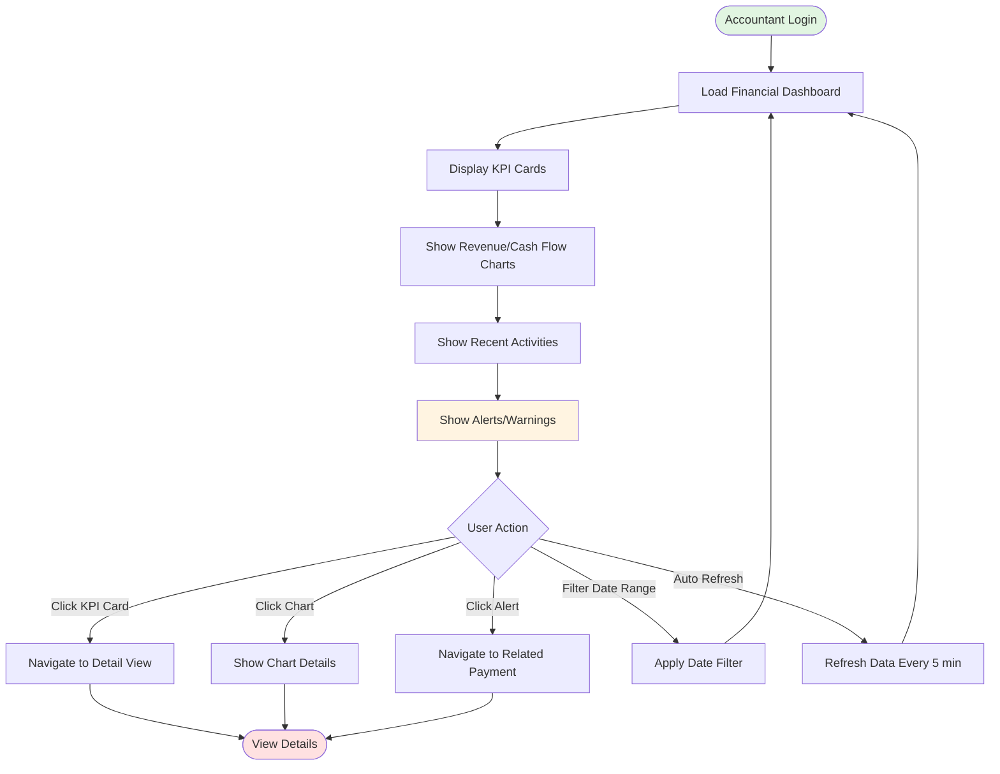

**Key Decision Points:**
- User có thể click vào bất kỳ KPI card, chart, hoặc alert để drill down
- Dashboard auto-refresh every 5 minutes để update real-time data

---

## FLOW 02: Create Payment Milestones

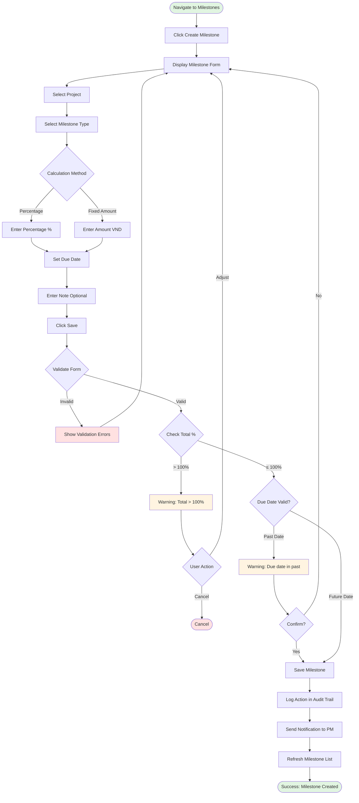

**Validation Rules:**
- Total percentage ≤ 100%
- Amount > 0
- Due date is valid
- All required fields filled

---

## FLOW 03: Confirm Customer Payment

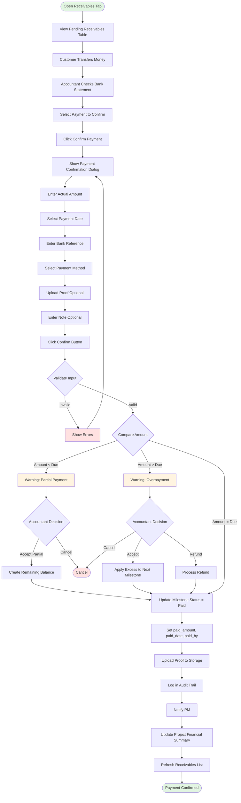

**Key Decision Points:**
- Partial payment → Accept hoặc Cancel
- Overpayment → Apply to next, Refund, hoặc Cancel
- All validations must pass before confirming

---

## FLOW 04: Confirm Outsource Payment

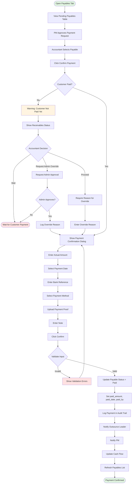

**Business Rules:**
- BR-PAY-08: Không thanh toán outsource nếu chưa nhận tiền customer (có thể override bởi Admin)
- All overrides must be logged với reason

---

## FLOW 05: Track Receivables (AR)

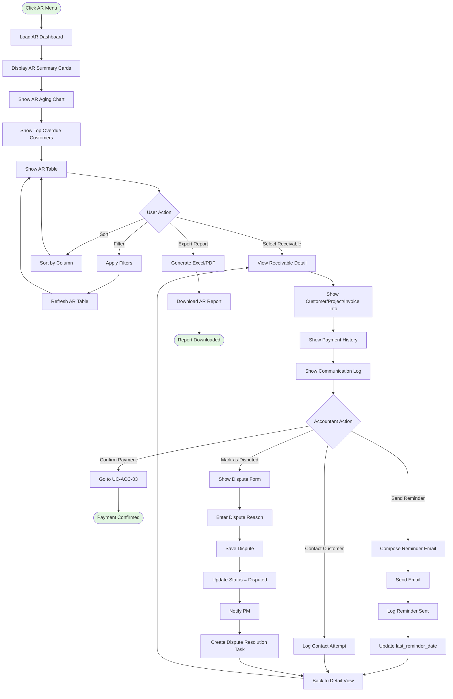

**Features:**
- Filter by customer, project, status, aging bucket
- Send payment reminders
- Mark as disputed
- Export AR aging report

---

## FLOW 06: Track Payables (AP)

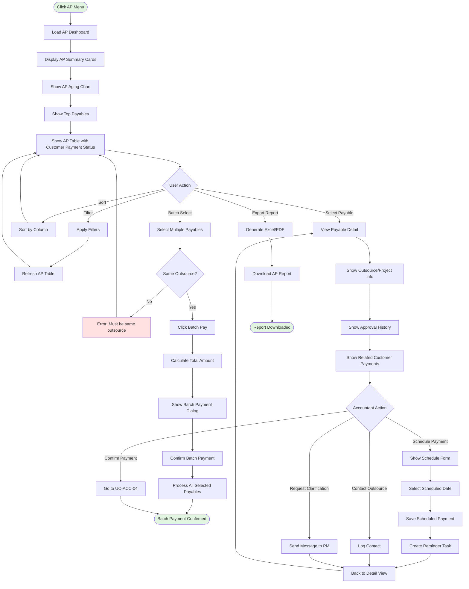

**Features:**
- Batch payment (same outsource)
- Schedule future payments
- View customer payment status
- Export AP aging report

---

## FLOW 07: Generate Financial Report

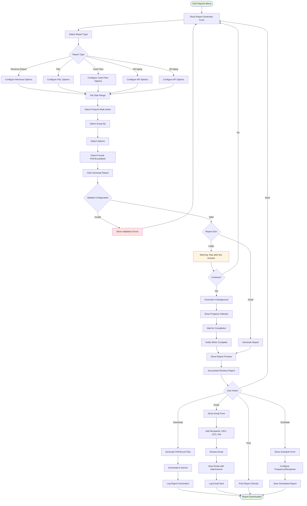

**Report Types:**
- Revenue Report
- Profit & Loss (P&L)
- Cash Flow Statement
- AR/AP Aging
- Tax Report (VAT)

---

## FLOW 08: Cash Flow Analysis

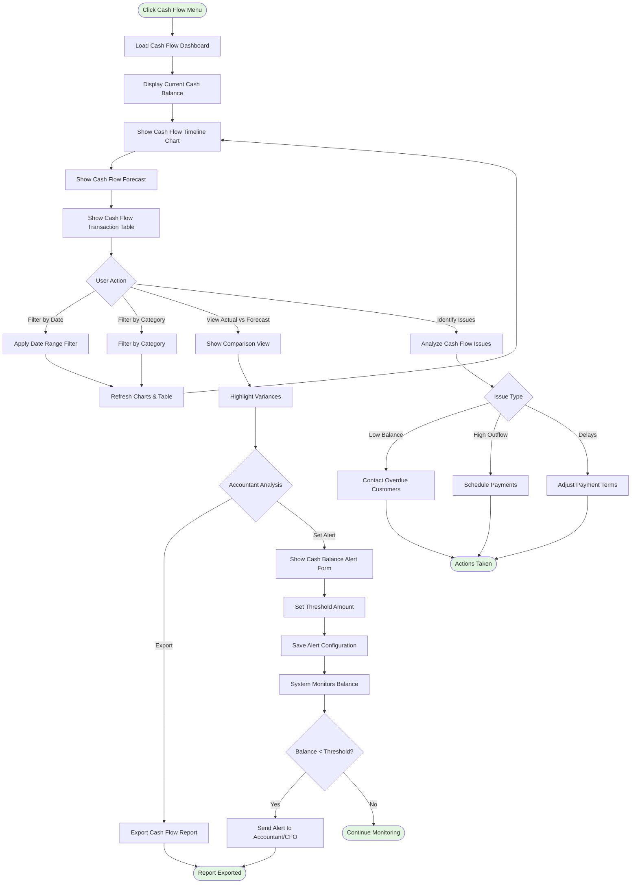

**Features:**
- Real-time cash balance monitoring
- Cash flow forecast (30/60/90 days)
- Variance analysis (actual vs forecast)
- Cash balance alerts

---

## FLOW 09: Payment Reconciliation

```mermaid
flowchart TD
    Start([Click Reconciliation Menu]) --> ShowWorkspace[Show Reconciliation Workspace]
    ShowWorkspace --> UploadChoice{Upload Method}
    
    UploadChoice -->|Upload File| UploadStatement[Upload Bank Statement CSV/Excel/PDF]
    UploadChoice -->|Manual Entry| ManualEntry[Manually Enter Transactions]
    
    UploadStatement --> ParseFile[System Parses File]
    ParseFile --> LoadBankTrans[Load Bank Transactions]
    ManualEntry --> LoadBankTrans
    
    LoadBankTrans --> LoadSystemTrans[Load System Transactions]
    LoadSystemTrans --> AutoMatch[System Auto-Matches Transactions]
    
    AutoMatch --> MatchByRef[Match by Bank Reference]
    MatchByRef --> MatchByAmount[Match by Amount + Date]
    MatchByAmount --> MatchByName[Match by Amount + Customer Name]
    MatchByName --> ShowResults[Display Matching Results]
    
    ShowResults --> DisplayMatched[Show Matched Transactions]
    DisplayMatched --> DisplayUnmatched[Show Unmatched in Bank]
    DisplayUnmatched --> DisplayUnmatchedSys[Show Unmatched in System]
    DisplayUnmatchedSys --> DisplayDiscrepancies[Show Amount Discrepancies]
    
    DisplayDiscrepancies --> ReviewMatches[Accountant Reviews Auto-Matches]
    ReviewMatches --> ReviewAction{Review Decision}
    
    ReviewAction -->|Accept Matches| ConfirmMatches[Confirm Auto-Matches]
    ReviewAction -->|Adjust Matches| ManualMatch[Manually Match Remaining]
    
    ManualMatch --> SelectBankTrans[Select Bank Transaction]
    SelectBankTrans --> SelectSysTrans[Select System Transaction]
    SelectSysTrans --> ClickMatch[Click Match Button]
    ClickMatch --> LinkTransactions[System Links Transactions]
    LinkTransactions --> RepeatManual{More to Match?}
    RepeatManual -->|Yes| ManualMatch
    RepeatManual -->|No| HandleDiscrepancies
    
    ConfirmMatches --> HandleDiscrepancies[Handle Discrepancies]
    
    HandleDiscrepancies --> DiscrepancyType{Discrepancy Type}
    
    DiscrepancyType -->|Amount Mismatch| CheckBankFees[Check Bank Fees/Exchange Rate]
    CheckBankFees --> CreateAdjustment[Create Adjustment Entry]
    CreateAdjustment --> ResolveDiscrepancy
    
    DiscrepancyType -->|Missing in System| CreateManualTrans[Create Manual Transaction]
    CreateManualTrans --> LinkToProject[Link to Project/Customer]
    LinkToProject --> ResolveDiscrepancy
    
    DiscrepancyType -->|Missing in Bank| InvestigateMissing[Investigate Missing]
    InvestigateMissing --> MissingAction{Resolution}
    MissingAction -->|Not Cleared Yet| MarkPending[Mark as Pending]
    MissingAction -->|Contact Bank| LogInquiry[Log Bank Inquiry]
    MissingAction -->|System Error| CorrectError[Correct System Error]
    MarkPending --> ResolveDiscrepancy
    LogInquiry --> ResolveDiscrepancy
    CorrectError --> ResolveDiscrepancy
    
    ResolveDiscrepancy[All Discrepancies Resolved] --> FinalizeRecon[Finalize Reconciliation]
    FinalizeRecon --> GenerateReport[Generate Reconciliation Report]
    GenerateReport --> SaveRecon[Save Reconciliation]
    SaveRecon --> UpdateTransStatus[Update Transaction Statuses]
    UpdateTransStatus --> Success([Reconciliation Complete])
    
    style Start fill:#e1f5e1
    style Success fill:#e1f5e1
```

**Matching Methods:**
1. By bank reference (highest priority)
2. By amount + date (±3 days)
3. By amount + customer name

**Discrepancy Handling:**
- Amount mismatch → Adjustment entry
- Missing in system → Create transaction
- Missing in bank → Pending/Investigate

---

## FLOW 10: Handle Payment Dispute

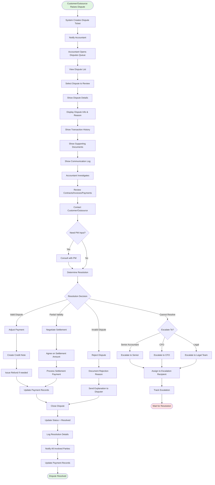

**Resolution Options:**
1. **Valid dispute** → Adjust payment, issue refund
2. **Invalid dispute** → Reject with explanation
3. **Partial validity** → Negotiate settlement
4. **Cannot resolve** → Escalate to Senior/CFO/Legal

**Escalation Criteria:**
- High-value disputes (>50M VND)
- Contractual issues
- Legal implications
- Unable to resolve within 30 days

---

## FLOW CONNECTIONS

### How Flows Connect

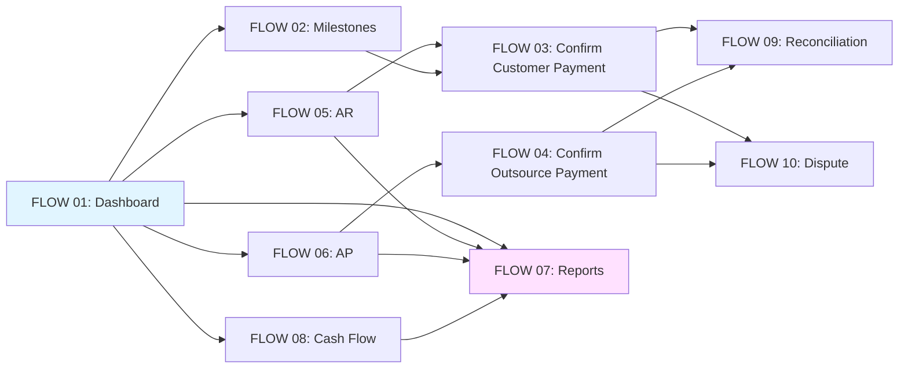

**Flow Integration:**
- Dashboard là entry point chính
- AR/AP flows dẫn đến payment confirmations
- Payment confirmations kết nối với reconciliation và disputes
- Tất cả flows có thể generate reports

---

**Status:** ✅ Complete  
**Total Flows:** 10 comprehensive user journeys  
**Coverage:** All major Accountant workflows  
**Tool:** Mermaid flowchart diagrams
