# User Flows - Admin Role

**Version:** 1.0  
**Role:** Admin (System Administrator)  
**Platform:** Desktop-only  
**Last Updated:** 12/02/2026  

---

## OVERVIEW

This document contains **12 detailed user flow diagrams** for the Admin role, covering:

1. User Management
2. Role Configuration
3. Schema Builder
4. Workflow Designer
5. Menu Management
6. System Settings
7. Integration Setup
8. Audit Log Review
9. Data Import
10. Backup Management
11. Performance Monitoring
12. Error Log Analysis

Each flow uses Mermaid diagrams to visualize the complete user journey, including decision points, error handling, and success states.

---

## FLOW 01: User Management

**Scenario:** Admin creates a new user account and assigns roles.

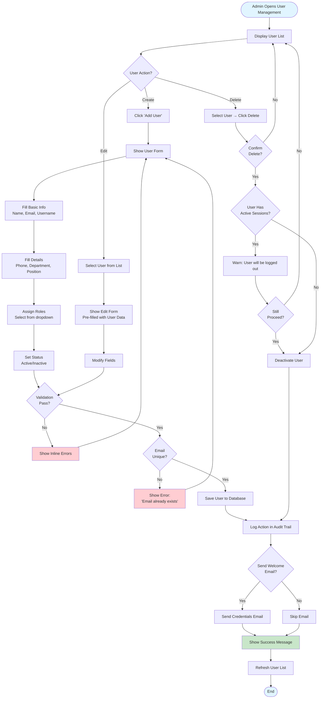

**Key Decision Points:**
- Validation: Email format, required fields
- Duplicate check: Email uniqueness
- Active sessions: Warn before deactivation

---

## FLOW 02: Role Configuration

**Scenario:** Admin creates a new role and assigns granular permissions.

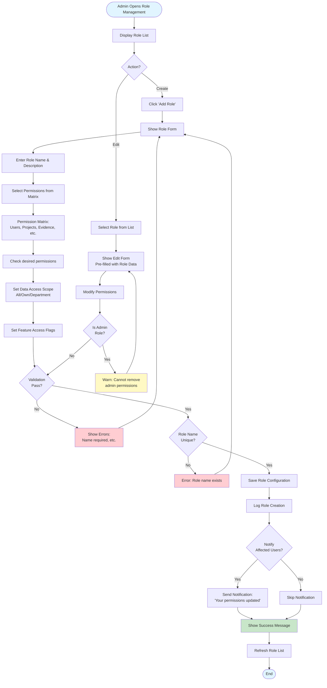

**Permission Categories:**
- Users: View, Create, Edit, Delete
- Projects: View All, View Own, Create, Edit, Delete
- Evidence: View, Approve, Reject
- Materials: View, Approve
- Quality: View, Create, Resolve
- Reports: View, Export
- System: Configure, Audit, Backup

---

## FLOW 03: Schema Builder

**Scenario:** Admin creates a new data schema (entity) with fields and relationships.

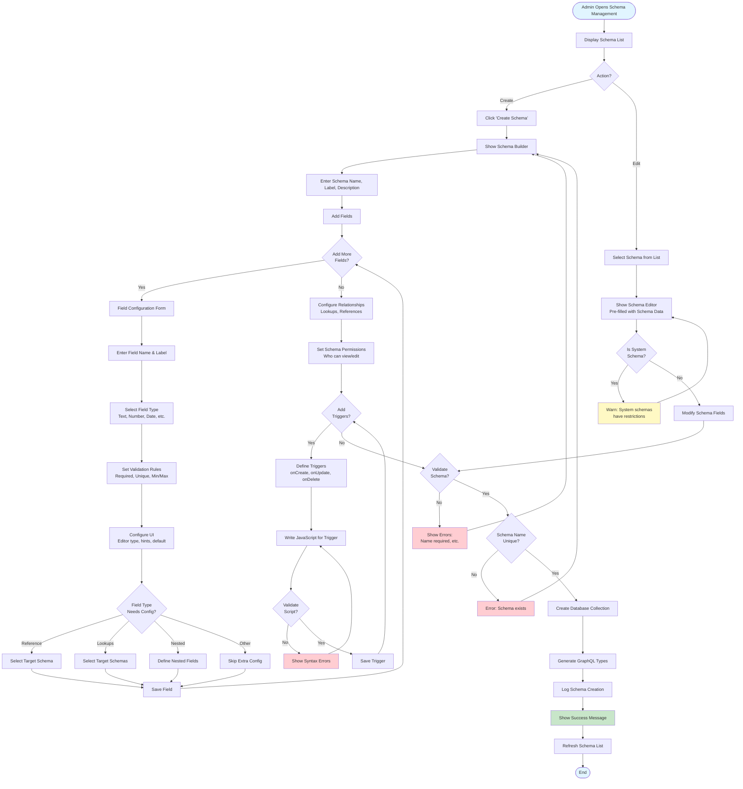

**Field Types:**
- Text, Number, Date, Boolean
- Reference (single), Lookups (multiple)
- Nested, Object, Tags
- File Upload, Geolocation

---

## FLOW 04: Workflow Designer

**Scenario:** Admin designs an approval workflow for evidence review.

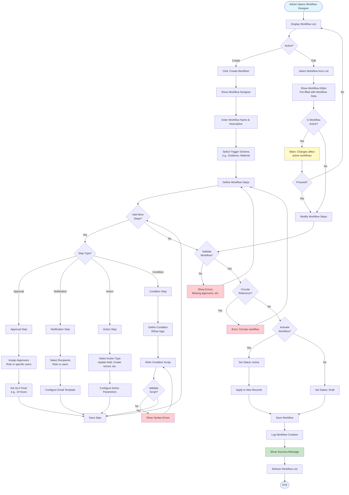

**Workflow Steps:**
- **Approval:** Require user action
- **Notification:** Send email/push
- **Action:** Execute script, update field
- **Condition:** Branch based on data

---

## FLOW 05: Menu Management

**Scenario:** Admin organizes application navigation menus.

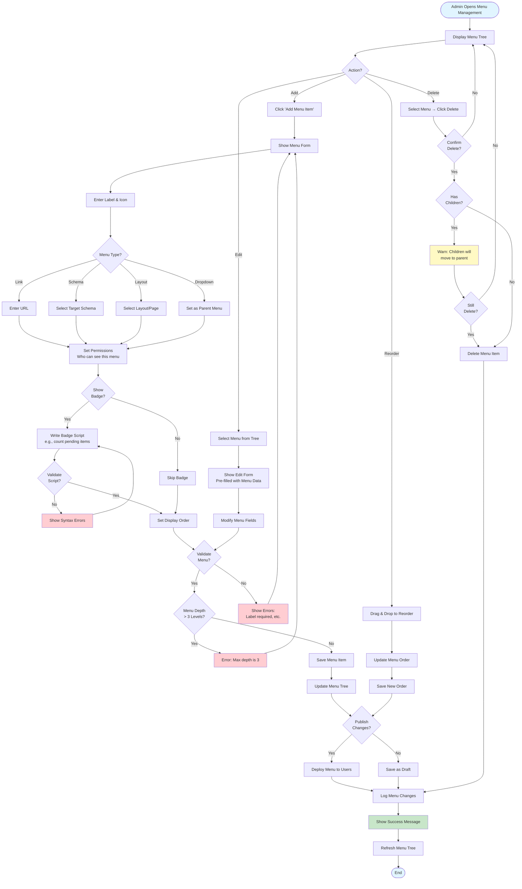

**Menu Types:**
- Link, Schema, Layout, Dropdown, Separator

---

## FLOW 06: System Settings

**Scenario:** Admin configures global system settings.

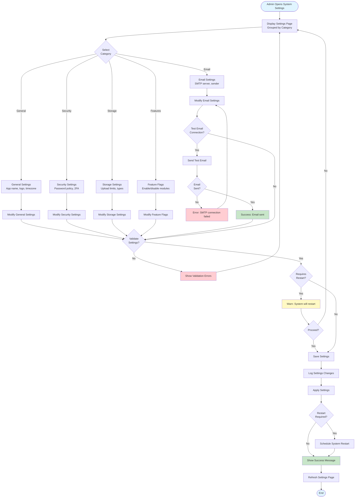

**Setting Categories:**
- General, Email, Security, Storage, Features, Integrations

---

## FLOW 07: Integration Setup

**Scenario:** Admin configures a third-party API integration.

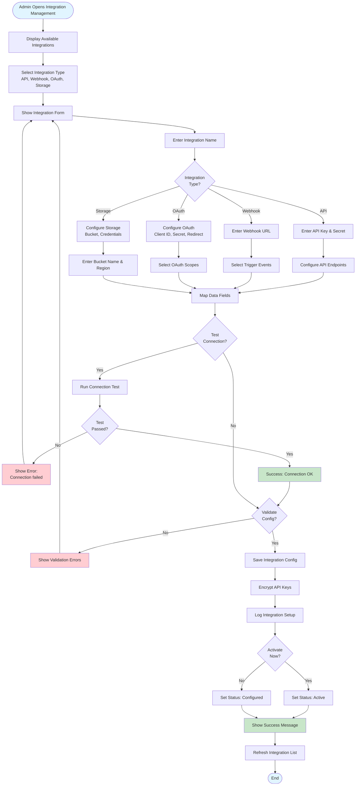

**Integration Types:**
- REST API, Webhooks, OAuth, File Storage (S3, Azure, GCS)

---

## FLOW 08: Audit Log Review

**Scenario:** Admin reviews system audit logs to track user actions.

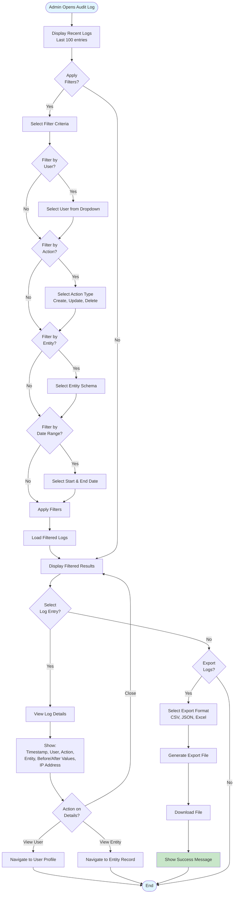

**Logged Actions:**
- User login/logout
- CRUD operations on all entities
- Permission changes
- System setting changes
- Integration activity

---

## FLOW 09: Data Import

**Scenario:** Admin imports user data from CSV file.

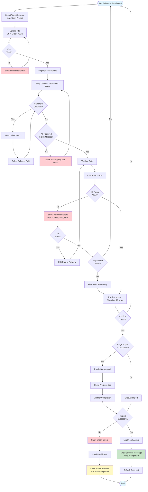

**Import Formats:**
- CSV, Excel (.xlsx), JSON

---

## FLOW 10: Backup Management

**Scenario:** Admin creates a full system backup.

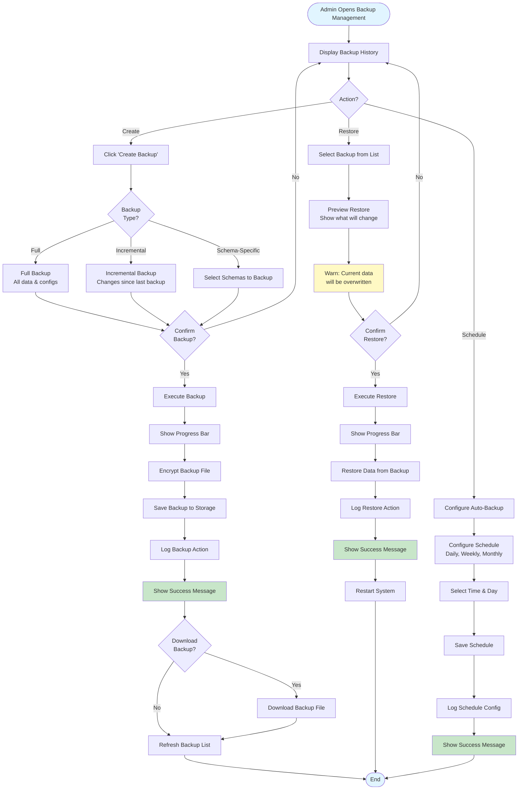

**Backup Types:**
- Full, Incremental, Schema-specific

---

## FLOW 11: Performance Monitoring

**Scenario:** Admin monitors system performance and sets alerts.

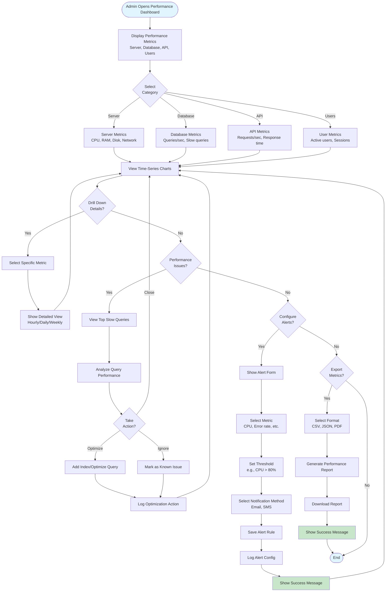

**Metrics:**
- Server: CPU, RAM, Disk, Network
- Database: Queries/sec, Slow queries, Connections
- API: Requests/sec, Response time, Error rate
- Users: Active users, Peak concurrent users

---

## FLOW 12: Error Log Analysis

**Scenario:** Admin reviews and resolves application errors.

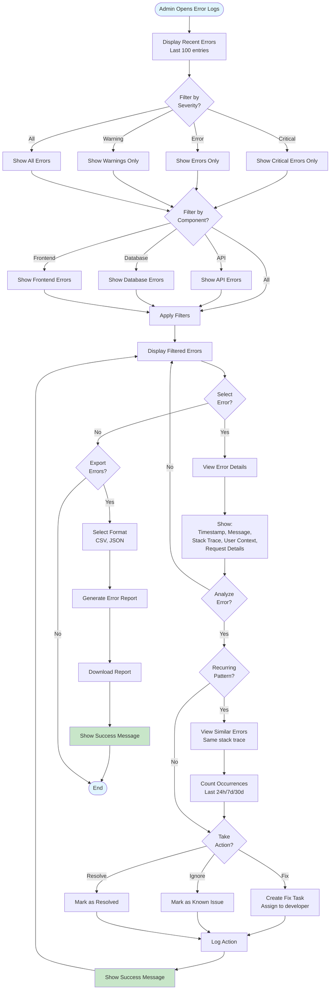

**Error Severity:**
- **Critical:** System down, data loss
- **Error:** Feature broken, user affected
- **Warning:** Potential issue, degraded performance

---

**Status:** ✅ Complete  
**Total Flows:** 12  
**Diagrams:** Mermaid format  
**Coverage:** All major Admin workflows
