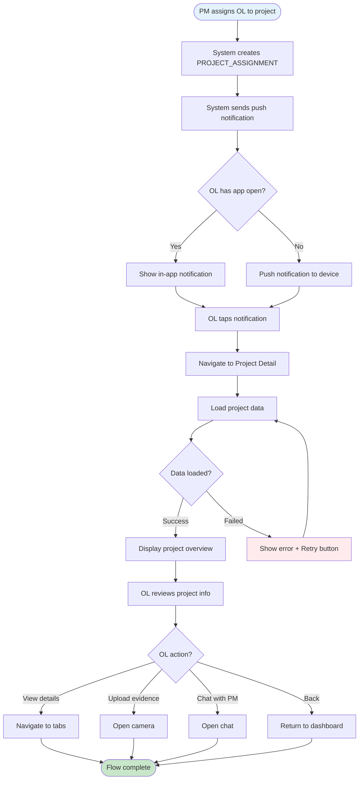
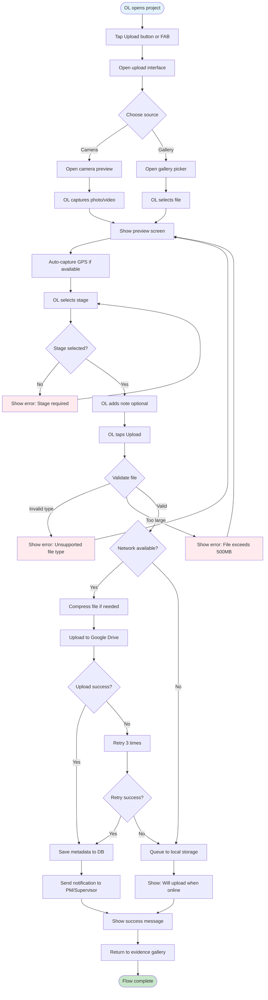
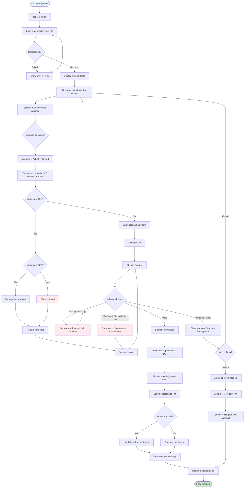
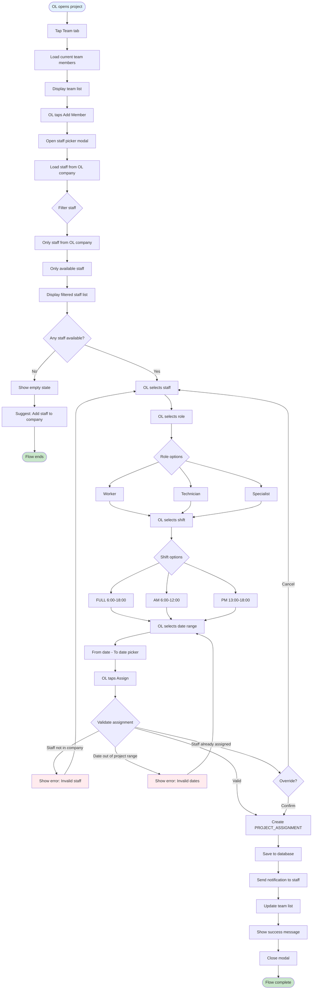
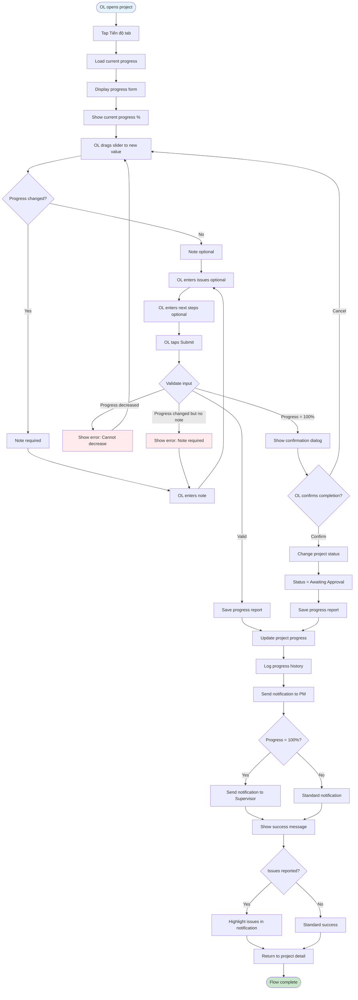
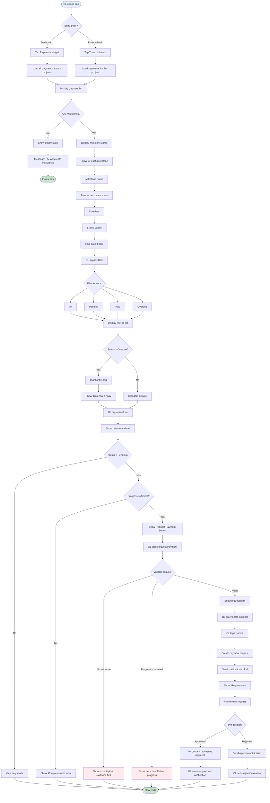

# 🔄 USER FLOWS - Outsource Leader

**SIRA Service Management Platform**  
**Role:** Outsource Leader  
**Version:** 1.0  
**Date:** 2026-02-12  

---

## 1. OVERVIEW

Document này mô tả 7 user flows chính cho Outsource Leader role, sử dụng Mermaid diagrams để visualize từng workflow.

**Key Flows:**
1. Nhận dự án mới
2. Upload evidence
3. Confirm vật tư
4. Assign team
5. Báo cáo tiến độ
6. Chat collaboration
7. Xem payment status

---

## 2. FLOW 1: Nhận Dự Án Mới

### 2.1 Flow Description

PM assign Outsource Leader vào dự án → OL nhận notification → OL login → View project → Accept/Acknowledge

### 2.2 Mermaid Diagram



### 2.3 Key Decision Points

- **Has app open?** → Determines notification delivery method
- **Data loaded?** → Handle network errors gracefully
- **OL action?** → Multiple paths from project detail

### 2.4 Error Handling

- Network error → Show retry button
- Project not found → Show error message + contact PM
- Permission denied → Show access denied message

---

## 3. FLOW 2: Upload Evidence

### 3.1 Flow Description

OL mở project → Chọn upload → Chụp ảnh/chọn từ gallery → Chọn stage → Add note → Upload → Success

### 3.2 Mermaid Diagram



### 3.3 Key Decision Points

- **Choose source** → Camera vs Gallery
- **Stage selected?** → Required field validation
- **Validate file** → Type and size checks
- **Network available?** → Online vs offline handling
- **Upload success?** → Retry logic

### 3.4 Offline Handling

- Queue uploads locally
- Auto-sync when network available
- Show sync status indicator
- Prevent duplicate uploads

---

## 4. FLOW 3: Confirm Vật Tư

### 4.1 Flow Description

OL mở project → Tab Vật tư → Nhập actual quantities → System calculate variance → Validate → Confirm → PM notified

### 4.2 Mermaid Diagram



### 4.3 Key Decision Points

- **Data loaded?** → Handle network errors
- **Variance > 10%?** → Require note
- **Variance > 20%?** → Require PM approval
- **Validate all items** → Multiple validation checks
- **OL confirms?** → Final confirmation for high variance

### 4.4 Business Rules

- Tolerance: 10% variance acceptable
- 10-20%: Require note
- \>20%: Require PM approval
- All quantities must be > 0

---

## 5. FLOW 4: Assign Team

### 5.1 Flow Description

OL mở project → Tab Team → Add member → Select staff → Choose role/shift/dates → Validate → Assign → Staff notified

### 5.2 Mermaid Diagram



### 5.3 Key Decision Points

- **Filter staff** → Only company members, only available
- **Any staff available?** → Empty state handling
- **Role options** → Worker/Technician/Specialist
- **Shift options** → FULL/AM/PM
- **Validate assignment** → Multiple validation checks
- **Override?** → Handle conflicts

### 5.4 Validation Rules

- Staff must belong to OL's company
- Date range must be within project timeline
- Staff must be available (not busy on other projects)
- Role and shift are required

---

## 6. FLOW 5: Báo Cáo Tiến Độ

### 6.1 Flow Description

OL mở project → Tab Tiến độ → Update progress slider → Add note/issues → Validate → Submit → PM notified

### 6.2 Mermaid Diagram



### 6.3 Key Decision Points

- **Progress changed?** → Determines if note is required
- **Validate input** → Multiple validation checks
- **Progress = 100%?** → Special handling for completion
- **OL confirms completion?** → Final confirmation
- **Issues reported?** → Highlight in notification

### 6.4 Business Rules

- Progress cannot decrease
- Note required if progress changed
- Progress = 100% triggers status change to "Awaiting Approval"
- PM and Supervisor notified on completion

---

## 7. FLOW 6: Chat Collaboration

### 7.1 Flow Description

OL mở project → Tab Chat → Type message → Optional: attach file/@mention → Send → Real-time delivery → Notification

### 7.2 Mermaid Diagram

```mermaid
flowchart TD
    Start([OL opens project]) --> A[Tap Chat tab]
    A --> B[Load chat messages]
    B --> C{WebSocket connected?}
    
    C -->|No| D[Show offline indicator]
    C -->|Yes| E[Display message list]
    
    D --> F[Queue messages locally]
    E --> G[OL types message]
    
    G --> H{OL action?}
    
    H -->|Send text| I[OL taps Send]
    H -->|Attach file| J[OL taps attach button]
    H -->|@Mention| K[OL types @]
    
    J --> L[Open file picker]
    L --> M[OL selects file]
    M --> N{Validate file}
    
    N -->|Too large > 10MB| O[Show error: Max 10MB]
    N -->|Valid| P[Upload file to storage]
    
    O --> L
    
    P --> Q{Upload success?}
    Q -->|Failed| R[Show error + Retry]
    Q -->|Success| S[Attach file URL to message]
    
    R --> P
    
    K --> T[Show participant list]
    T --> U[OL selects user]
    U --> V[Insert @mention in message]
    V --> I
    
    S --> I
    
    I --> W{Network available?}
    
    W -->|No| X[Queue message locally]
    W -->|Yes| Y[Send via WebSocket]
    
    X --> Z[Show: Will send when online]
    Y --> AA[Save message to DB]
    
    AA --> AB[Broadcast to participants]
    AB --> AC{Has @mention?}
    
    AC -->|Yes| AD[Send push notification to mentioned user]
    AC -->|No| AE[In-app notification only]
    
    AD --> AF[Display message in chat]
    AE --> AF
    Z --> AF
    
    AF --> AG[Scroll to bottom]
    AG --> AH{Auto-sync when online?}
    
    AH -->|Yes| AI[Send queued messages]
    AH -->|No| End1([Flow complete])
    
    AI --> End1
    
    style Start fill:#e3f2fd
    style End1 fill:#c8e6c9
    style O fill:#ffebee
    style R fill:#ffebee
```

### 7.3 Key Decision Points

- **WebSocket connected?** → Online vs offline mode
- **OL action?** → Text/File/Mention
- **Validate file** → Size check
- **Upload success?** → Retry logic
- **Network available?** → Queue or send immediately
- **Has @mention?** → Push notification trigger
- **Auto-sync when online?** → Send queued messages

### 7.4 Real-time Features

- WebSocket for instant delivery
- Typing indicators (optional)
- Read receipts (optional)
- Message status: Sending → Sent → Delivered

---

## 8. FLOW 7: Xem Payment Status

### 8.1 Flow Description

OL mở dashboard/project → Tab Thanh toán → View milestones → Filter → Optional: Request payment → PM reviews

### 8.2 Mermaid Diagram



### 8.3 Key Decision Points

- **Entry point?** → Dashboard vs Project detail
- **Any milestones?** → Empty state handling
- **Filter options** → All/Pending/Paid/Overdue
- **Status = Overdue?** → Highlight in red
- **Status = Pending?** → Show request button
- **Progress sufficient?** → Validate before request
- **Validate request** → Evidence and progress checks
- **PM decision** → Approved vs Rejected

### 8.4 Business Rules

- OL can only view payment status (not create/edit)
- OL only sees outsource share (not full contract value)
- Payment request requires:
  - Progress >= milestone requirement
  - Evidence uploaded (DURING/AFTER)
- Overdue milestones highlighted in red

---

## 9. FLOW SUMMARY

| Flow | Complexity | Key Features | Error Handling |
|------|------------|--------------|----------------|
| 1. Nhận dự án | Medium | Push notification, in-app | Network error, permission denied |
| 2. Upload evidence | High | Camera, GPS, offline queue | File validation, upload retry |
| 3. Confirm vật tư | High | Variance calculation, PM approval | Validation, high variance alert |
| 4. Assign team | Medium | Staff filtering, availability | Conflict resolution, validation |
| 5. Báo cáo tiến độ | Medium | Progress tracking, completion | Cannot decrease, note required |
| 6. Chat collaboration | High | Real-time, file attach, @mention | Offline queue, file size limit |
| 7. Payment status | Medium | Filter, request payment | Validation, PM approval |

---

## 10. COMMON PATTERNS

### 10.1 Network Error Handling

All flows implement:
- Retry button on failure
- Offline queue for writes
- Auto-sync when back online
- Clear error messages

### 10.2 Validation

All input flows implement:
- Client-side validation
- Server-side validation
- User-friendly error messages
- Prevent invalid submissions

### 10.3 Notifications

All flows that trigger notifications:
- Push notification (if app closed)
- In-app notification (if app open)
- Badge count update
- Navigate to relevant screen on tap

### 10.4 Loading States

All flows implement:
- Skeleton screens for initial load
- Spinners for actions
- Progress bars for uploads
- Optimistic UI updates

---

## 11. MOBILE-SPECIFIC CONSIDERATIONS

### 11.1 Touch Gestures

- **Pull-to-refresh:** Dashboard, project list, chat
- **Swipe:** Delete notifications, navigate images
- **Long press:** Context menu, copy text
- **Pinch:** Zoom images

### 11.2 Camera Integration

- Native camera API
- Auto GPS tagging
- Flash control
- Front/back camera switch

### 11.3 Offline-First

- Queue uploads locally
- Queue chat messages
- Sync when online
- Show sync status

---

**Version:** 1.0  
**Date:** 2026-02-12  
**Status:** Draft  
**Author:** SIRA Tech Team
