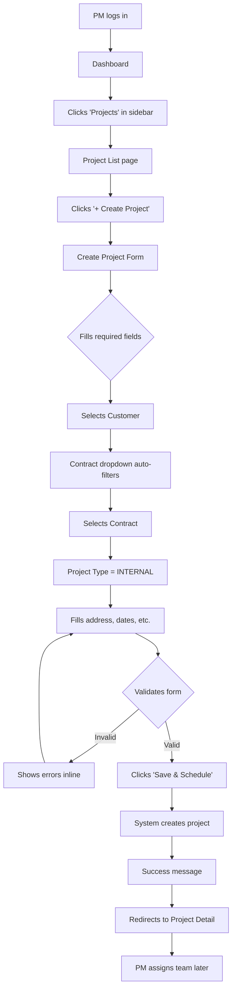
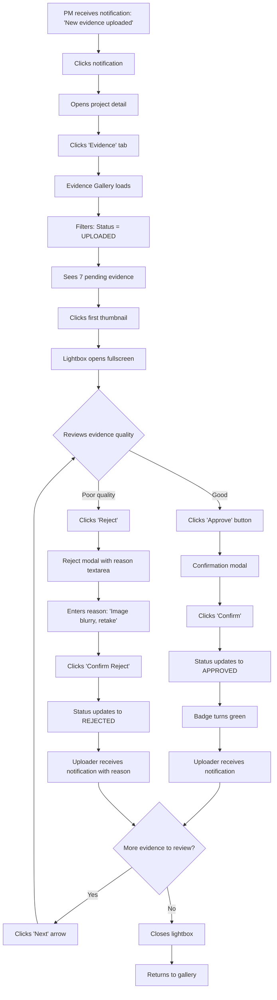
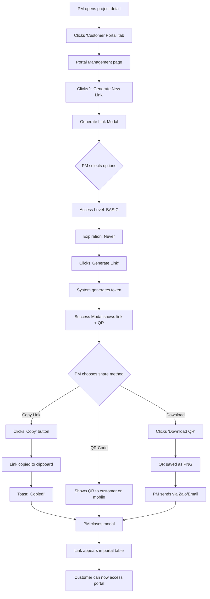
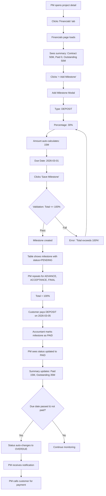
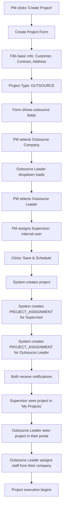
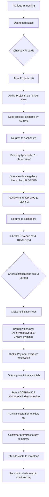
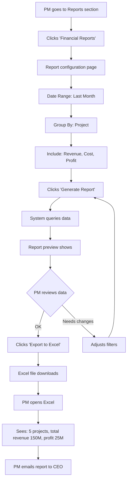

# User Flows - Project Manager (PM)
**SIRA Service Management Platform**

---

## Flow 1: Create Internal Project

**Goal**: PM wants to create a new internal construction project

**Steps**:

**Wireframes**:
- Dashboard: `01_Dashboard.txt`
- Project List: `04_Project_List.txt`
- Create Form: `05_Project_Create_Internal.txt`
- Project Detail: `07_Project_Detail_Overview.txt`

**Estimated Time**: 2-3 minutes

---

## Flow 2: Review & Approve Evidence

**Goal**: PM reviews evidence uploaded by Supervisor and approves it

**Steps**:

**Wireframes**:
- Evidence Gallery: `08_Evidence_Gallery.txt`
- Evidence Lightbox: `09_Evidence_Lightbox.txt`

**Estimated Time**: 30 seconds per evidence

---

## Flow 3: Generate Customer Portal Link

**Goal**: PM generates a portal link to share with customer for progress updates

**Steps**:

**Wireframes**:
- Portal Management: `12_Portal_Management.txt`
- Generate Modal: `13_Generate_Link_Modal.txt`
- Success Modal: `13_Generate_Link_Modal.txt` (bottom half)

**Estimated Time**: 1 minute

---

## Flow 4: Track Payment Milestones

**Goal**: PM creates payment milestones and tracks payment status

**Steps**:

**Wireframes**:
- Financials Tab: `10_Financials_Tab.txt`
- Add Milestone Modal: `11_Add_Milestone_Modal.txt`

**Estimated Time**: 5 minutes (to create all milestones)

---

## Flow 5: Assign Outsource Team to Project

**Goal**: PM creates an outsource project and assigns outsource team

**Steps**:

**Wireframes**:
- Create Outsource Form: `06_Project_Create_Outsource.txt`
- Project Detail: `07_Project_Detail_Overview.txt`

**Estimated Time**: 3-4 minutes

---

## Flow 6: Monitor Dashboard & Take Action

**Goal**: PM starts their day by checking dashboard and taking action on alerts

**Steps**:

**Wireframes**:
- Dashboard: `01_Dashboard.txt`
- Top Navigation: `02_Top_Navigation.txt`

**Estimated Time**: 10-15 minutes (morning routine)

---

## Flow 7: Export Financial Report for Management

**Goal**: PM exports monthly financial report for management review

**Steps**:

**Estimated Time**: 3 minutes

---

**Total Flows**: 7 main user journeys  
**Average Time per Flow**: 2-10 minutes  
**Version**: 1.0  
**Date**: 2026-02-12
