# 🔄 USER FLOWS - Supervisor

**SIRA Service Management Platform**  
**Role:** Supervisor  
**Version:** 1.0  
**Date:** 2026-02-12  

---

## TABLE OF CONTENTS

1. [Dashboard & Overview](#1-dashboard--overview)
2. [Evidence Review Flow](#2-evidence-review-flow)
3. [Material Variance Approval](#3-material-variance-approval)
4. [Quality Issue Management](#4-quality-issue-management)
5. [Project Monitoring](#5-project-monitoring)
6. [Team Performance Review](#6-team-performance-review)
7. [Analytics & Reporting](#7-analytics--reporting)
8. [Field Inspection (Mobile)](#8-field-inspection-mobile)
9. [Batch Operations](#9-batch-operations)
10. [Notification Handling](#10-notification-handling)

---

## 1. DASHBOARD & OVERVIEW

### 1.1 Login to Dashboard

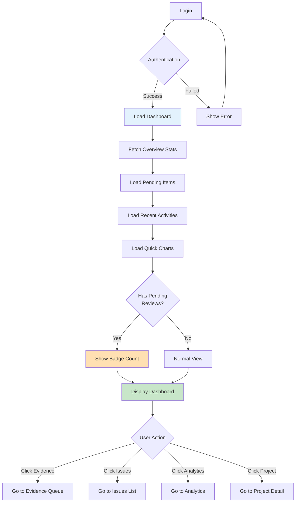

**Key Decision Points:**
- Authentication validation
- Pending review count check
- User navigation choice

**Success Criteria:**
- Dashboard loads within 2 seconds
- All stats display correctly
- Notifications are accurate

---

## 2. EVIDENCE REVIEW FLOW

### 2.1 Evidence Queue to Approval

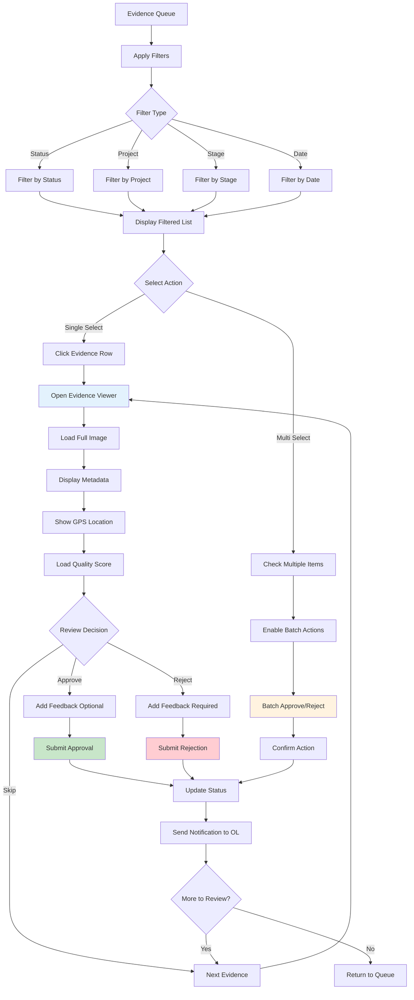

**Key Decision Points:**
- Filter selection
- Single vs. batch review
- Approve/Reject/Skip decision
- Feedback requirement (mandatory for reject)

**Success Criteria:**
- Image loads within 1 second
- GPS location displays on map
- Feedback saves correctly
- Notification sent to OL immediately

---

### 2.2 Evidence Viewer Detail Flow

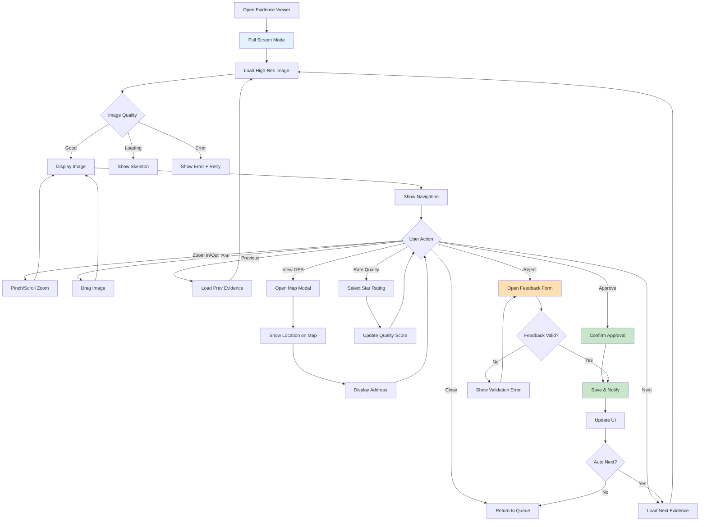

**Key Features:**
- Full-screen immersive review
- Zoom/pan controls
- GPS verification
- Quality rating
- Keyboard shortcuts (A=Approve, R=Reject, →=Next)

---

## 3. MATERIAL VARIANCE APPROVAL

### 3.1 Material Variance Request Flow

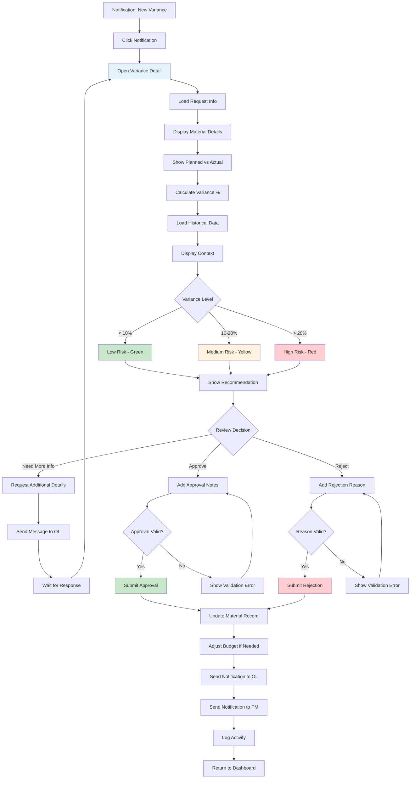

**Key Decision Points:**
- Variance risk level assessment
- Need for additional information
- Approve/Reject decision
- Budget impact consideration

**Business Rules:**
- Variance < 10%: Auto-recommend approval
- Variance 10-20%: Review required
- Variance > 20%: Escalation to PM required
- Rejection reason mandatory

**Success Criteria:**
- Historical data loads correctly
- Variance calculation accurate
- Budget updates automatically
- All stakeholders notified

---

## 4. QUALITY ISSUE MANAGEMENT

### 4.1 Quality Issue Creation & Resolution

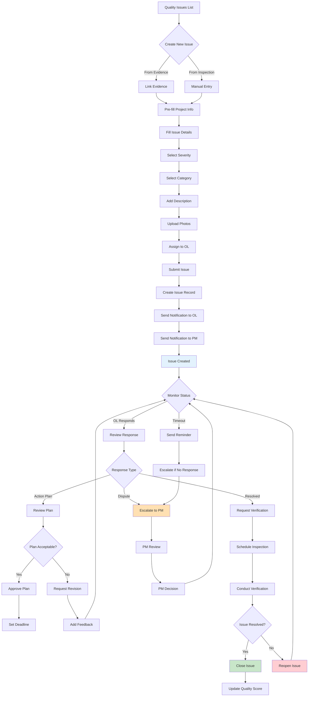

**Key Decision Points:**
- Issue severity classification
- Response evaluation
- Plan approval
- Resolution verification

**Severity Levels:**
- Critical: Work stoppage required
- High: Immediate attention needed
- Medium: Address within 48h
- Low: Monitor and resolve

**Success Criteria:**
- Issue created within 2 minutes
- All stakeholders notified
- Response tracked
- Resolution verified

---

## 5. PROJECT MONITORING

### 5.1 Project Overview & Drill-Down

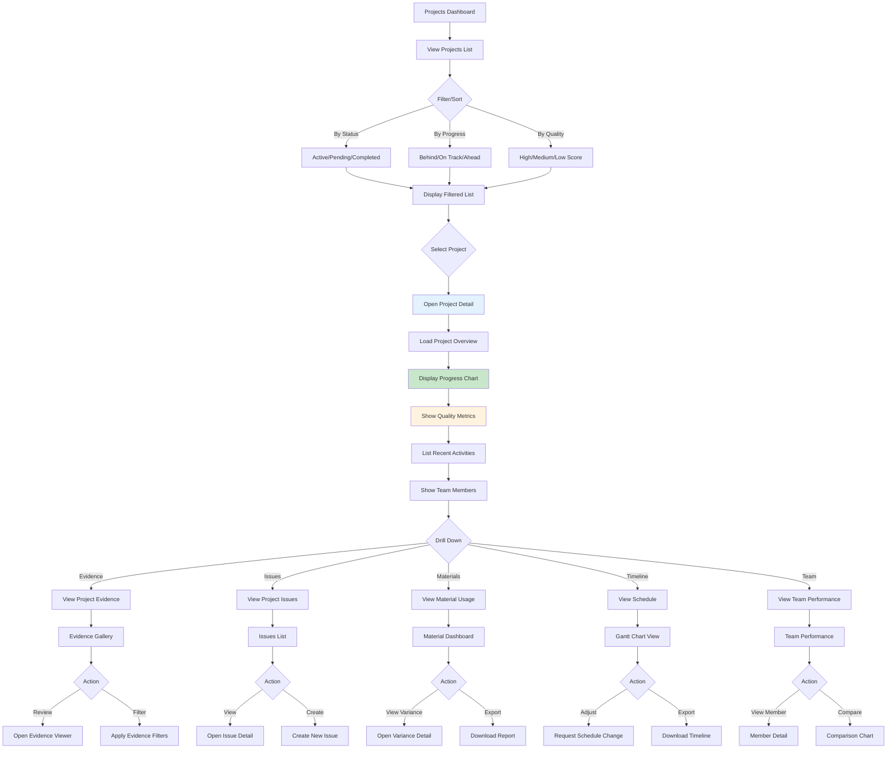

**Key Features:**
- Multi-dimensional filtering
- Drill-down navigation
- Real-time metrics
- Export capabilities

**Metrics Displayed:**
- Overall progress %
- Quality score average
- Evidence approval rate
- Issue resolution rate
- Material variance %
- Schedule adherence

---

## 6. TEAM PERFORMANCE REVIEW

### 6.1 OL Performance Monitoring

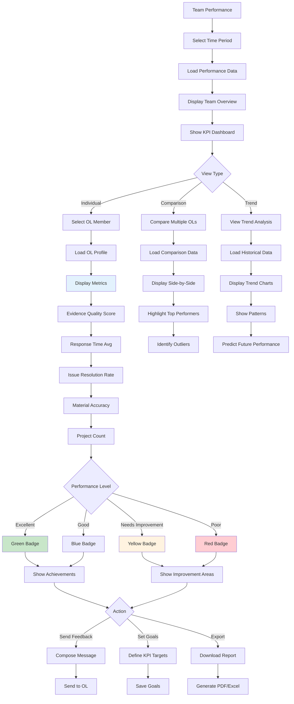

**KPIs Tracked:**
- Evidence quality score (avg)
- Evidence submission timeliness
- Issue response time
- Issue resolution rate
- Material variance accuracy
- Communication responsiveness
- Safety compliance rate

**Performance Thresholds:**
- Excellent: 90%+ across all KPIs
- Good: 75-89%
- Needs Improvement: 60-74%
- Poor: < 60%

---

## 7. ANALYTICS & REPORTING

### 7.1 Analytics Dashboard & Report Generation

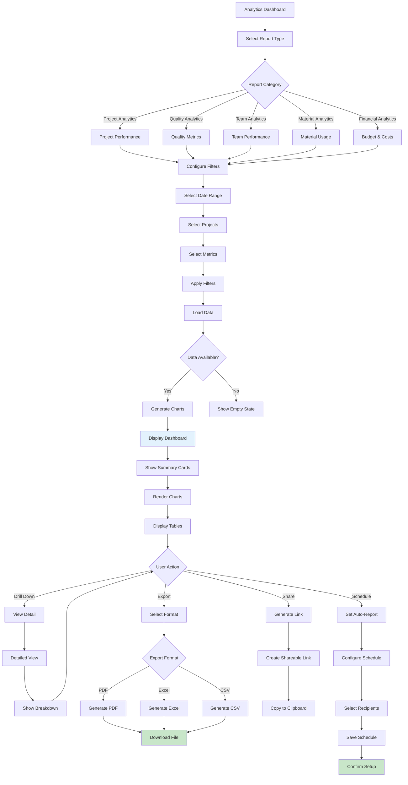

**Report Types:**

1. **Project Performance:**
   - Progress trends
   - Quality scores
   - Timeline adherence
   - Budget variance

2. **Quality Metrics:**
   - Evidence approval rates
   - Issue distribution
   - Resolution times
   - Quality score trends

3. **Team Performance:**
   - OL rankings
   - KPI comparisons
   - Productivity trends
   - Response times

4. **Material Analytics:**
   - Usage patterns
   - Variance trends
   - Cost analysis
   - Waste reduction

**Export Formats:**
- PDF: Executive summary with charts
- Excel: Raw data + pivot tables
- CSV: Data export for analysis

---

## 8. FIELD INSPECTION (MOBILE)

### 8.1 Mobile Inspection Flow

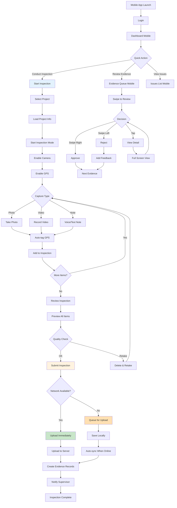

**Mobile-Specific Features:**
- Offline mode support
- Auto GPS tagging
- Camera integration
- Voice notes
- Swipe gestures
- Auto-sync when online

**Offline Capabilities:**
- Queue uploads
- Local storage
- Sync indicator
- Conflict resolution

---

## 9. BATCH OPERATIONS

### 9.1 Bulk Evidence Approval

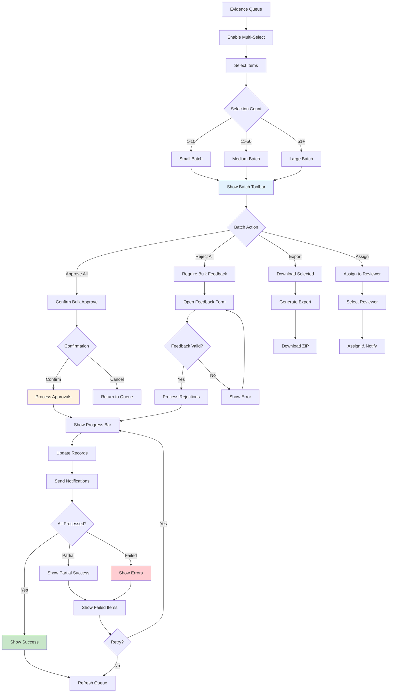

**Batch Operation Rules:**
- Max 100 items per batch
- Progress indicator required
- Rollback on critical errors
- Partial success handling
- Detailed error reporting

**Performance:**
- Process 10 items/second
- Show progress every 10%
- Timeout after 5 minutes
- Auto-retry failed items (3x)

---

## 10. NOTIFICATION HANDLING

### 10.1 Notification Flow

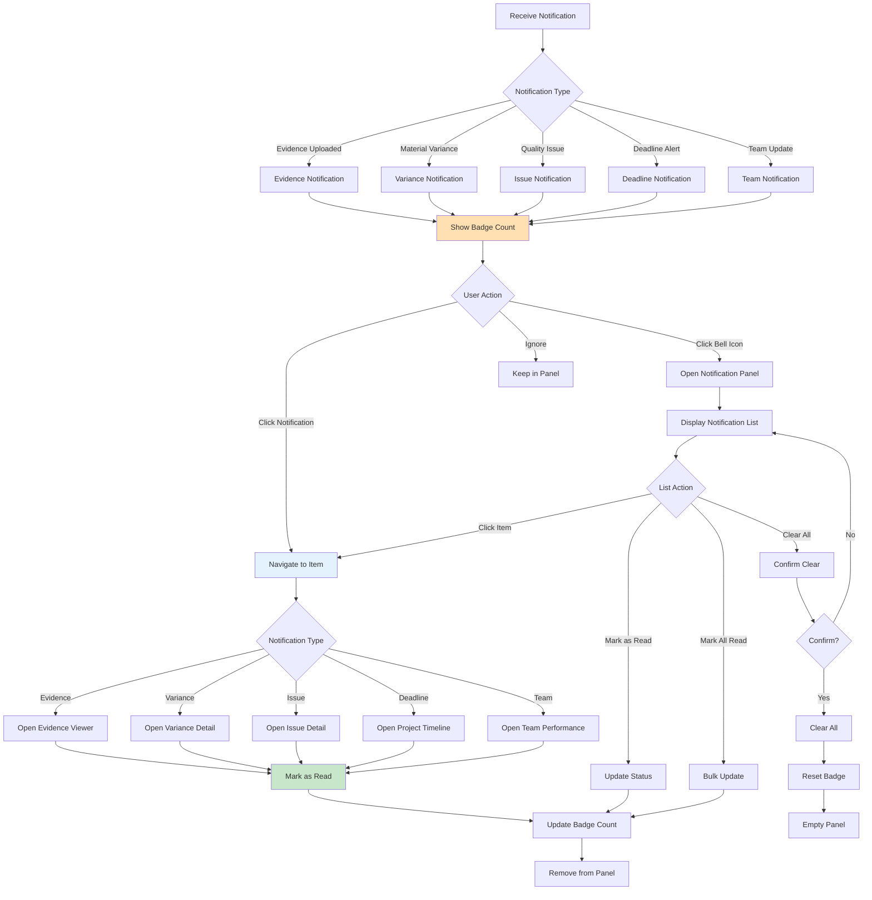

**Notification Priority:**
1. **Critical:** Quality issues, deadline overdue
2. **High:** Material variance, evidence pending
3. **Medium:** Team updates, reports ready
4. **Low:** General announcements

**Notification Channels:**
- In-app badge
- Push notification (mobile)
- Email digest (daily)
- SMS (critical only)

**Auto-Clear Rules:**
- Read notifications: 7 days
- Unread notifications: 30 days
- Critical: Never auto-clear

---

## APPENDIX

### A. Navigation Shortcuts

| Screen | Desktop Shortcut | Mobile Gesture |
|--------|------------------|----------------|
| Dashboard | Ctrl+D | Tap Dashboard tab |
| Evidence Queue | Ctrl+E | Tap Evidence tab |
| Issues | Ctrl+I | Tap Issues tab |
| Analytics | Ctrl+A | Swipe right from edge |
| Search | Ctrl+K or / | Pull down |
| Notifications | Ctrl+N | Swipe down from top |
| Approve (in review) | A | Swipe right |
| Reject (in review) | R | Swipe left |
| Next item | → or Space | Swipe up |
| Previous item | ← | Swipe down |

### B. State Transitions

**Evidence Status:**
```
PENDING → APPROVED → ARCHIVED
        ↓
      REJECTED → RESUBMITTED → PENDING
```

**Quality Issue Status:**
```
OPEN → IN_PROGRESS → RESOLVED → CLOSED
     ↓              ↓
   ESCALATED    REOPENED → IN_PROGRESS
```

**Material Variance Status:**
```
REQUESTED → APPROVED → APPLIED
          ↓
        REJECTED → REVISED → REQUESTED
```

### C. Error Handling

**Common Errors:**
1. Network timeout → Retry with exponential backoff
2. Invalid data → Show validation errors inline
3. Permission denied → Redirect to login
4. Server error → Show error message + support contact
5. Offline mode → Queue actions for sync

**Error Recovery:**
- Auto-save form data
- Resume interrupted uploads
- Retry failed operations
- Preserve user context

### D. Performance Benchmarks

| Operation | Target Time | Max Time |
|-----------|-------------|----------|
| Dashboard load | < 2s | 5s |
| Evidence viewer open | < 1s | 3s |
| Image load (full-res) | < 2s | 5s |
| Filter application | < 500ms | 2s |
| Batch operation (10 items) | < 5s | 15s |
| Report generation | < 10s | 30s |
| Export download | < 5s | 20s |

---

**Document Status:** Complete  
**Related Documents:**
- FDD_Supervisor.md - Functional requirements
- Layout_Spec_Supervisor.md - UI specifications
- Wireframes_Supervisor/ - Visual designs

**Next Steps:** Create wireframes for all 10 user flows
