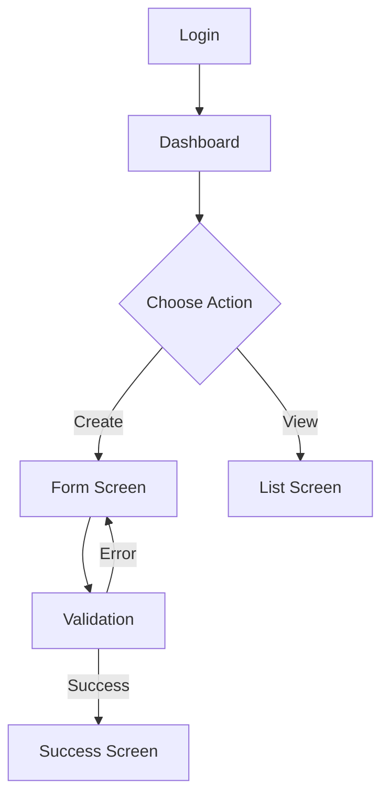

# FDD - {ROLE_NAME} Layout
**SIRA Service Management Platform - UI/UX Design**

---

## 1. ROLE OVERVIEW

### 1.1 Role Information

| Attribute | Value |
|-----------|-------|
| **Role Name** | {ROLE_NAME} |
| **Primary Device** | Desktop / Tablet / Mobile |
| **Max Container Width** | {1920px / 1280px / 1024px} |
| **Design Approach** | Desktop-first / Mobile-first |

### 1.2 Responsibilities

| Responsibility | Description |
|----------------|-------------|
| 1. | |
| 2. | |
| 3. | |

### 1.3 Daily Tasks

1. **Morning**: 
2. **During Day**: 
3. **End of Day**: 

### 1.4 Pain Points (Current System)

| Pain Point | Impact | Proposed Solution |
|------------|--------|-------------------|
| 1. | High/Medium/Low | |
| 2. | | |

---

## 2. LAYOUT DESIGN

### 2.1 Layout Structure

```
┌─────────────────────────────────────┐
│ Top Navigation Bar                  │
├──────┬──────────────────────────────┤
│      │                              │
│ Side │  Main Content Area           │
│ Menu │                              │
│      │                              │
│      │                              │
└──────┴──────────────────────────────┘
```

### 2.2 Navigation Structure

**Top Navigation**:
- Logo/Brand
- Notifications
- Profile menu
- Quick actions

**Side Menu** (if applicable):
- Dashboard
- Feature 1
- Feature 2
- Settings

**Bottom Navigation** (for mobile):
- Home
- Tasks
- Upload
- Profile

### 2.3 Dashboard (Home Screen)

#### Widgets

| Widget | Position | Size | Purpose |
|--------|----------|------|---------|
| Widget 1 | Top-left | 6 cols | Overview stats |
| Widget 2 | Top-right | 6 cols | Quick actions |
| Widget 3 | Bottom | 12 cols | Recent items |

#### Wireframe Reference

See [`Wireframes_{ROLE}/01_Dashboard.png`](file:///)

### 2.4 Responsive Design

| Breakpoint | Behavior |
|------------|----------|
| **Desktop (>1024px)** | Full layout with sidebar |
| **Tablet (768-1024px)** | Collapsible sidebar |
| **Mobile (<768px)** | Bottom navigation, hamburger menu |

**Special Requirements** (for Supervisor):
- Max container width: **1024px**
- Mobile-first approach
- Large touch targets (min 44x44px)
- Swipe gestures for evidence review

---

## 3. FEATURE LIST

### Feature 1: {Feature Name}

**Description**: 

**User Story**: As {role}, I want to {goal} so that {benefit}

**Use Cases**: 
- UC-{ROLE}-01: {Use case name}
- UC-{ROLE}-02: {Use case name}

**Wireframe**: See [`Wireframes_{ROLE}/02_Feature1.png`](file:///)

**Priority**: High / Medium / Low

---

### Feature 2: {Feature Name}

(Repeat for each feature)

---

## 4. USE CASES

### UC-{ROLE}-01: {Use Case Name}

**Actor**: {ROLE_NAME}

**Precondition**: 
- User is logged in
- User has permission {permission_name}

**Main Flow**:

1. User navigates to {screen}
2. System displays {data}
3. User clicks {action button}
4. System validates input
5. System saves data
6. System displays success message

**Alternative Flows**:

**AF-01: Validation Error**
- 4a. If validation fails:
  - System highlights error fields
  - User corrects errors
  - Resume at step 4

**Exception Flows**:

**EF-01: Network Error**
- *. If network fails:
  - System displays offline message
  - System caches data locally
  - System retries when online

**Postcondition**: 
- Data is saved
- User sees confirmation

**UI Screens**:

| Screen | Wireframe | Description |
|--------|-----------|-------------|
| Screen 1 | `03_UC01_Screen1.png` | List view |
| Screen 2 | `04_UC01_Screen2.png` | Form view |

**Acceptance Criteria**:

- [ ] AC-01: Validation shows within 500ms
- [ ] AC-02: Success message auto-dismisses after 3s
- [ ] AC-03: Mobile: form is scrollable with fixed submit button

---

## 5. USER STORIES & EPICS

### Epic 1: {Epic Name}

**Goal**: As {role}, I want to {epic goal}

**Value**: {business value}

**Dependencies**: None / Epic X

---

#### Story 1.1: {Story Name}

**User Story**: As {role}, I can {action} so that {benefit}

**Acceptance Criteria**:

- [ ] AC-01: Given {context}, when {action}, then {expected result}
- [ ] AC-02: UI displays {element} with {property}
- [ ] AC-03: Response time < 2s for {action}

**UI Tasks**:

- [ ] Task 1.1.1: Create form component with validation
- [ ] Task 1.1.2: Integrate with API endpoint `/api/{endpoint}`
- [ ] Task 1.1.3: Add loading state and error handling
- [ ] Task 1.1.4: Mobile responsive testing

**Story Points**: {1/2/3/5/8}

---

#### Story 1.2: {Story Name}

(Repeat for each story)

---

## 6. UI/UX SPECIFICATIONS

### 6.1 Color Scheme

| Element | Color | Hex | Usage |
|---------|-------|-----|-------|
| Primary | Blue | #1890ff | Buttons, links |
| Success | Green | #52c41a | Success states |
| Warning | Yellow | #faad14 | Warnings |
| Error | Red | #ff4d4f | Errors |
| Text Primary | Dark Gray | #262626 | Main text |
| Text Secondary | Gray | #8c8c8c | Helper text |
| Background | White | #ffffff | Main background |
| Border | Light Gray | #d9d9d9 | Dividers |

### 6.2 Typography

| Element | Font | Size | Weight | Line Height |
|---------|------|------|--------|-------------|
| H1 | Inter | 32px | 600 | 1.2 |
| H2 | Inter | 24px | 600 | 1.3 |
| H3 | Inter | 20px | 600 | 1.4 |
| Body | Inter | 14px | 400 | 1.5 |
| Caption | Inter | 12px | 400 | 1.5 |
| Button | Inter | 14px | 500 | 1 |

### 6.3 Spacing

| Space | Value | Usage |
|-------|-------|-------|
| xs | 4px | Tight spacing |
| sm | 8px | Small spacing |
| md | 16px | Default spacing |
| lg | 24px | Section spacing |
| xl | 32px | Large gaps |

### 6.4 Component Library

**Reusable Components**:

1. **Button**
   - Variants: Primary, Secondary, Ghost, Link
   - Sizes: Small, Medium, Large
   - States: Default, Hover, Active, Disabled, Loading

2. **Input**
   - Types: Text, Number, Date, Select, Textarea
   - States: Default, Focus, Error, Disabled
   - Validation: Inline error messages

3. **Card**
   - Variants: Default, Bordered, Hoverable
   - Slots: Header, Body, Footer

4. **Table**
   - Features: Sorting, Filtering, Pagination
   - Mobile: Converts to cards on mobile

5. **Modal**
   - Sizes: Small, Medium, Large, Fullscreen
   - Types: Confirm, Form, Info

### 6.5 Responsive Breakpoints

```css
/* Desktop */
@media (min-width: 1024px) {
  .container {
    max-width: 1280px; /* or 1024px for Supervisor */
  }
}

/* Tablet */
@media (min-width: 768px) and (max-width: 1023px) {
  .container {
    max-width: 100%;
    padding: 16px;
  }
}

/* Mobile */
@media (max-width: 767px) {
  .container {
    max-width: 100%;
    padding: 12px;
  }
}
```

### 6.6 Accessibility

- [ ] Color contrast ratio >= 4.5:1
- [ ] Keyboard navigation support
- [ ] Screen reader labels
- [ ] Focus indicators
- [ ] Alt text for images

---

## 7. USER FLOWS

### Flow 1: {Flow Name}

**Scenario**: User wants to {goal}

**Steps**:



**Wireframes**:
- Step 1: `05_Flow1_Step1.png`
- Step 2: `06_Flow1_Step2.png`
- Step 3: `07_Flow1_Step3.png`

---

## 8. INTERACTION PATTERNS

### 8.1 Loading States

- **Skeleton Screen**: For initial page load
- **Spinner**: For inline actions
- **Progress Bar**: For file uploads

### 8.2 Error Handling

- **Toast Notification**: For general errors
- **Inline Validation**: For form errors
- **Error Page**: For 404/500 errors

### 8.3 Confirmations

- **Modal Dialog**: For destructive actions
- **Inline Confirmation**: For quick actions
- **Undo Toast**: For reversible actions

---

## 9. PERFORMANCE REQUIREMENTS

| Metric | Target | Measurement |
|--------|--------|-------------|
| **Initial Page Load** | < 2s | Time to interactive |
| **Navigation** | < 500ms | Route change |
| **Form Submission** | < 1s | Submit to response |
| **Image Load** | < 3s | Progressive loading |
| **API Calls** | < 1s | 95th percentile |

---

## 10. TESTING REQUIREMENTS

### 10.1 Browser Support

- [ ] Chrome (latest 2 versions)
- [ ] Firefox (latest 2 versions)
- [ ] Safari (latest 2 versions)
- [ ] Edge (latest 2 versions)

### 10.2 Device Support

- [ ] Desktop (1920x1080, 1366x768)
- [ ] Tablet (iPad, 768x1024)
- [ ] Mobile (iPhone, Android, 375x667)

### 10.3 Test Scenarios

- [ ] Happy path for all use cases
- [ ] Error scenarios
- [ ] Edge cases (empty states, max data)
- [ ] Offline mode (if applicable)

---

## 11. DEPENDENCIES

| Dependency | Type | Status | Notes |
|------------|------|--------|-------|
| API Endpoints | Backend | ⏳ Pending | See API Spec |
| Google Drive API | External | ✅ Ready | For file storage |
| Authentication | Backend | ✅ Ready | JWT-based |

---

## 12. APPENDIX

### 12.1 Wireframe Index

1. [`01_Dashboard.png`](file:///) - Dashboard overview
2. [`02_Feature1.png`](file:///) - Feature 1 main screen
3. [`03_Feature2.png`](file:///) - Feature 2 main screen
...

### 12.2 Changelog

| Version | Date | Changes | Author |
|---------|------|---------|--------|
| 1.0 | 2026-02-12 | Initial version | BA |

---

**Document Owner**: UX Designer  
**Reviewers**: {ROLE} representatives  
**Last Updated**: 2026-02-12  
**Status**: Draft / In Review / Approved
