# Quản lý mẫu tài liệu và chữ ký điện tử v4

## 1. Mục tiêu

Capability này được bổ sung để chuẩn hóa toàn bộ vòng đời tài liệu nghiệp vụ:

- sinh tài liệu từ dữ liệu hệ thống
- in/PDF đúng mẫu
- ký điện tử trên màn hình touch hoặc ký nội bộ
- lưu thành biên bản số
- đồng bộ file lên cloud và Google Drive

Capability này không phải màn hình phụ. Đây là lớp nền dùng chung cho `Sale`, `HanhChinh`, `Accountant`, `PM`, `Director` và `Customer`.

## 2. Phạm vi tài liệu cần hỗ trợ

| Nhóm | Ví dụ |
|---|---|
| Khảo sát | Phiếu khảo sát, báo cáo tổng hợp công trình |
| Báo giá | Báo giá khách hàng, phụ lục giá |
| Hợp đồng | Hợp đồng thi công, mua bán, bảo hành, phụ lục |
| Tài chính | Phiếu tạm ứng, đề nghị thanh toán, biên nhận |
| Hiện trường | Biên bản giao hàng, biên bản nghiệm thu |
| Hậu mãi | Phiếu bảo hành, báo cáo bảo trì, biên bản xử lý sự cố |
| Giao tiếp | Mail mẫu, thông báo chuẩn, thư gửi khách |

## 3. Actor sử dụng

| Vai trò | Trách nhiệm |
|---|---|
| Sale | Chọn mẫu đúng ngữ cảnh khách hàng, xem preview và follow quá trình ký |
| HanhChinh | Quản lý thư viện mẫu, phát hành hồ sơ, nhận lại hồ sơ, lưu trữ |
| Accountant | Cấu hình mẫu tài chính, phát hành phiếu tạm ứng/đề nghị thanh toán |
| PM/Giám sát | Tạo biên bản hiện trường, nghiệm thu, bảo trì |
| Director | Ký duyệt các tài liệu cần thẩm quyền |
| Customer | Ký touch hoặc xác nhận trên thiết bị được chỉ định |
| Admin | Cấu hình quyền, tích hợp storage, audit, chính sách ký |

## 4. Chức năng bắt buộc

### 4.1 Quản lý mẫu tài liệu

| ID | Chức năng |
|---|---|
| DOC-01 | Danh mục mẫu theo loại tài liệu |
| DOC-02 | Versioning mẫu tài liệu |
| DOC-03 | Cấu hình placeholder/merge field |
| DOC-04 | Gắn điều kiện áp dụng theo loại dịch vụ/khu vực/giai đoạn |
| DOC-05 | Preview dữ liệu đã merge trước khi phát hành |
| DOC-06 | Sinh PDF/biên bản số từ template |
| DOC-07 | Khóa version đã phát hành để tránh sai lệch hồ sơ lịch sử |

### 4.2 Chữ ký điện tử

| ID | Chức năng |
|---|---|
| SIG-01 | Tạo luồng ký theo thứ tự người ký |
| SIG-02 | Hỗ trợ ký touch trực tiếp trên màn hình |
| SIG-03 | Ghi nhận người ký, vai trò ký, thời điểm ký, thiết bị ký |
| SIG-04 | Cho phép nhiều người ký trên cùng một biên bản |
| SIG-05 | Sinh file PDF đã ký và khóa nội dung sau khi hoàn tất |
| SIG-06 | Lưu audit trail đầy đủ của từng sự kiện ký |

### 4.3 Lưu trữ và đồng bộ

| ID | Chức năng |
|---|---|
| DOC-08 | Gắn tài liệu vào ngữ cảnh nghiệp vụ: Service Request, Contract, Project, Payment, Warranty |
| DOC-09 | Lưu bản nháp, bản phát hành, bản đã ký |
| DOC-10 | Đồng bộ file lên Google Drive theo folder map chuẩn |
| DOC-11 | Cho phép tìm kiếm hồ sơ theo khách hàng/công trình/số chứng từ |
| DOC-12 | Quản lý retention và quyền xem theo vai trò |

## 5. Luồng chuẩn

```mermaid
flowchart LR
    A["Chọn loại tài liệu"] --> B["Chọn template version"]
    B --> C["Merge dữ liệu từ hồ sơ nghiệp vụ"]
    C --> D["Preview và kiểm tra"]
    D --> E["Phát hành bản PDF/biên bản số"]
    E --> F["Thiết lập thứ tự người ký"]
    F --> G["Ký touch / ký nội bộ"]
    G --> H["Khóa bản đã ký"]
    H --> I["Lưu hồ sơ số"]
    I --> J["Đồng bộ Google Drive và nhật ký audit"]
```

## 6. Business rules

1. Một tài liệu đã ký xong phải trở thành `immutable record`; không được sửa nội dung trực tiếp.
2. Sửa nội dung phải sinh `version mới` hoặc `tài liệu mới`, không ghi đè file cũ.
3. Mỗi template phải có:
   - mã mẫu
   - loại tài liệu
   - danh sách placeholder bắt buộc
   - version hoạt động
   - owner nghiệp vụ
4. Trước khi phát hành tài liệu cho khách, hệ thống phải kiểm tra đủ dữ liệu merge bắt buộc.
5. Tài liệu tài chính và hợp đồng phải lưu được `document number` để tra cứu.
6. Mọi sự kiện ký phải lưu được:
   - người ký
   - vai trò ký
   - thời điểm ký
   - thiết bị hoặc nguồn ký
   - trạng thái thành công/thất bại/hủy
7. Chữ ký touch chỉ có giá trị khi gắn với một `signature session` và một `document snapshot` cụ thể.
8. File đẩy lên Google Drive chỉ là bản đồng bộ; `metadata` và `audit` vẫn thuộc hệ thống BAC Group.

## 7. Yêu cầu phi chức năng

- Hỗ trợ `PDF A4` chuẩn in ấn, có header/footer nếu cấu hình.
- Cho phép nhúng logo, con dấu scan, chữ ký scan hoặc chữ ký touch.
- Hỗ trợ tiếng Việt có dấu đầy đủ trong template và file xuất.
- Có `audit log` cho cả thao tác xem, phát hành, gửi ký, ký xong, tải xuống.
- Có cơ chế `retry` khi đồng bộ Google Drive thất bại.
- Có policy che dữ liệu nhạy cảm trên bản xem trước nếu người dùng không đủ quyền.

## 8. Tác động tới kiến trúc tổng thể

Capability này ảnh hưởng trực tiếp tới:

- `Module A`: báo giá, hợp đồng, process làm việc với khách
- `Module E`: phiếu tạm ứng, đề nghị thanh toán, nghiệm thu, bảo hành/bảo trì
- `Module F`: audit, permission, file governance, Google Drive sync

Trong BA-V4, capability này được nâng lên thành `Module G - Document Automation & Digital Signature` để tránh bị chìm như một tính năng phụ.
