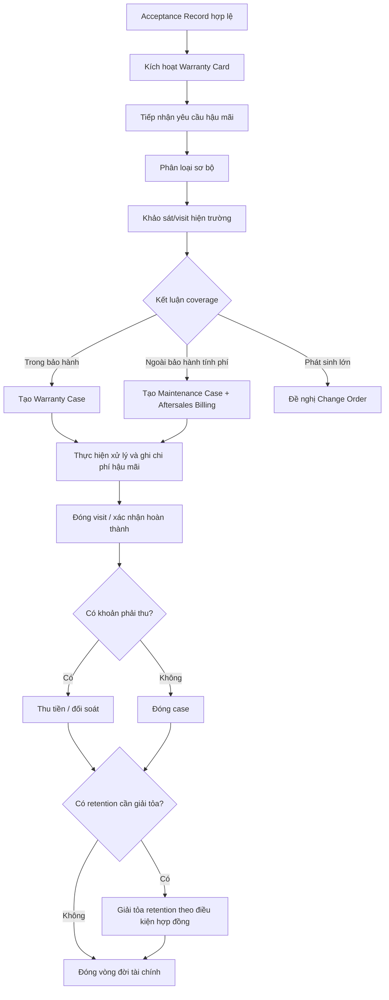

# Vòng đời bảo hành, bảo trì và tài chính v4

## 1. Mục tiêu

Tài liệu này đóng chi tiết phần mà BA cũ còn mỏng:

- kích hoạt bảo hành sau nghiệm thu
- tiếp nhận yêu cầu bảo hành/bảo trì
- phân loại trong bảo hành hay tính phí
- ghi nhận chi phí hậu mãi
- tạo khoản phải thu phát sinh nếu ngoài phạm vi bảo hành
- theo dõi `retention/giữ lại bảo hành` nếu hợp đồng áp dụng
- phản ánh `đã thu`, `công nợ`, `còn lại` và chi phí thực tế theo công trình

## 2. Vai trò tham gia

| Vai trò | Trách nhiệm chính |
|---|---|
| PM | Theo dõi chất lượng tổng thể, quyết định change order nếu phát sinh ngoài phạm vi lớn |
| Supervisor | Khảo sát hiện trường hậu mãi, cập nhật visit, bằng chứng, tình trạng xử lý |
| Accountant | Ghi nhận chi phí, khoản phải thu, trạng thái thanh toán, báo cáo tài chính hậu mãi |
| HanhChinh | Phát hành hồ sơ bảo trì/bảo hành, đề nghị thanh toán phát sinh, lưu dossier |
| Admin | Cấu hình mẫu warranty, SLA, lý do phân loại, template thông báo |
| Customer Portal | Gửi/yêu cầu xem tiến độ hậu mãi ở mức được công bố |

## 3. Điểm khởi đầu của vòng đời

Một case hậu mãi chỉ hợp lệ khi có:

- `Acceptance Record` hợp lệ
- `Project` đã xác định được mốc bàn giao
- `Warranty Card` đã được phát hành hoặc có rule xác định dự án không thuộc diện bảo hành nhưng vẫn tiếp nhận bảo trì tính phí

## 4. Luồng chuẩn từ nghiệm thu đến đóng case

## 5. Các trạng thái nghiệp vụ đề xuất

### 5.1 Warranty Card

- `DRAFT`
- `ACTIVE`
- `EXPIRED`
- `VOID`

### 5.2 Warranty/Maintenance Case

- `NEW`
- `TRIAGED`
- `SCHEDULED`
- `IN_PROGRESS`
- `WAITING_CUSTOMER`
- `WAITING_PAYMENT`
- `COMPLETED`
- `CLOSED`
- `CANCELLED`

### 5.3 Aftersales Billing

- `DRAFT`
- `ISSUED`
- `PARTIALLY_PAID`
- `PAID`
- `WAIVED`
- `VOID`

## 6. Quy tắc phân loại case

Mỗi yêu cầu hậu mãi phải được phân loại thành một trong ba nhóm:

1. `Trong phạm vi bảo hành`
2. `Ngoài phạm vi bảo hành nhưng hỗ trợ bảo trì tính phí`
3. `Phát sinh lớn cần change order/project task riêng`

Tiêu chí phân loại tối thiểu:

- còn hay hết hạn bảo hành
- lỗi thi công hay yêu cầu sử dụng mới
- có nằm trong danh mục loại trừ bảo hành không
- mức độ phát sinh có vượt ngưỡng hậu mãi hay không

## 7. Quy tắc tài chính bắt buộc

### 7.1 Ghi nhận chi phí

Mọi visit hậu mãi phải ghi được:

- chi phí vật tư
- chi phí nhân công
- chi phí di chuyển
- chi phí thuê ngoài nếu có

### 7.2 Khoản phải thu phát sinh

Nếu case ngoài phạm vi bảo hành:

- phải tạo `Aftersales Billing`
- phải thấy rõ căn cứ tính phí
- phải liên kết với giao dịch thu tiền

### 7.3 Lịch thanh toán và giữ lại bảo hành

Hệ thống phải hỗ trợ:

- nhiều mẫu lịch thanh toán theo hợp đồng
- thanh toán nhiều đợt
- partial collection
- giữ lại bảo hành theo tỷ lệ hoặc số tiền
- giải tỏa retention khi đạt điều kiện thời gian/chất lượng

Các trường tối thiểu phải nhìn được:

- giá trị hợp đồng
- đã thu
- công nợ còn lại
- retention đang giữ
- retention đã giải tỏa

### 7.4 Tác động tới P&L

Dashboard tài chính dự án phải nhìn được:

- doanh thu hợp đồng
- chi phí triển khai
- chi phí hậu mãi trong bảo hành
- doanh thu bảo trì tính phí
- lợi nhuận thực sau hậu mãi
- phần giữ lại bảo hành chưa giải tỏa

## 8. Luồng nghiệp vụ chi tiết

### 8.1 Kích hoạt bảo hành

Điều kiện:

- nghiệm thu hợp lệ
- không bị treo do tranh chấp

Kết quả:

- sinh `Warranty Card`
- xác định `start_date`, `end_date`
- mở nhắc lịch hậu mãi định kỳ nếu có

### 8.2 Tiếp nhận yêu cầu hậu mãi

Nguồn tiếp nhận:

- PM tạo nội bộ
- Accountant/CSKH nhập hộ
- khách hàng gửi qua portal hoặc hotline rồi nội bộ nhập vào hệ thống

Thông tin tối thiểu:

- dự án liên quan
- mô tả vấn đề
- ngày phát hiện
- ảnh/video nếu có
- mức độ ưu tiên

### 8.3 Khảo sát và kết luận

`Supervisor` là người cập nhật tác nghiệp chính trên hệ thống:

- đặt lịch visit
- đính kèm bằng chứng
- mô tả nguyên nhân sơ bộ
- đề xuất coverage result
- đính kèm `báo cáo hiện trạng/bảo trì` nếu case yêu cầu hồ sơ chính thức

### 8.4 Xử lý hiện trường

Case hậu mãi có thể:

- sinh task nội bộ
- dùng vật tư từ kho
- cần checklist và evidence như dự án thi công

Vì vậy hậu mãi không được xem là module tách rời khỏi `Task`, `Inventory` và `File governance`.

### 8.5 Thu tiền nếu tính phí

Khi case thuộc diện tính phí:

- tạo `Aftersales Billing`
- tạo `Document Record` cho đề nghị thanh toán hoặc hồ sơ phát hành tương ứng
- công bố cho kế toán/PM
- thu tiền và đối soát
- chỉ đóng case hoàn toàn khi trạng thái tài chính rõ ràng

## 9. KPI và báo cáo cần có

- số case bảo hành/bảo trì theo tháng
- tỷ lệ case trong bảo hành vs tính phí
- chi phí hậu mãi theo dự án
- thời gian xử lý trung bình theo mức ưu tiên
- tỷ lệ tái phát lỗi
- doanh thu bảo trì tính phí
- giá trị retention đang treo theo dự án
- tỷ lệ case đã hoàn thành kỹ thuật nhưng còn chờ thanh toán

## 10. Các edge case cần khóa rule

| Tình huống | Rule xử lý |
|---|---|
| Khách báo lỗi khi chưa nghiệm thu | Không kích hoạt warranty, chuyển về xử lý dự án hoặc dispute |
| Hết hạn bảo hành nhưng công ty hỗ trợ miễn phí | Vẫn tạo case, billing ở trạng thái `WAIVED`, phải có lý do |
| Khảo sát thấy phát sinh lớn ngoài hậu mãi | Chuyển change order, không xử lý như maintenance visit thông thường |
| Đã hoàn thành kỹ thuật nhưng khách chưa thanh toán phí bảo trì | Case ở `WAITING_PAYMENT`, chưa `CLOSED` hoàn toàn |
| Một lỗi lặp lại nhiều lần | Báo cáo KPI và cảnh báo chất lượng dự án/đội thi công |

## 11. Kết luận

Phần bảo hành/bảo trì chỉ thực sự đầy đủ khi BAC Group nhìn được cùng lúc 4 lớp:

- tình trạng kỹ thuật
- bằng chứng hiện trường
- chi phí hậu mãi
- khoản phải thu/phải miễn trừ

Đó là lý do BA-V4 đưa hậu mãi vào cùng trục với `Acceptance` và `Finance`, thay vì xem như tính năng phụ sau bán hàng.
