# ERD v4 - Mô hình dữ liệu chuẩn cho BAC Group

## 1. Mục tiêu của ERD v4

ERD v4 được dựng để giải quyết các thiếu hụt của mô hình cũ:

- Tách `Customer` khỏi `Service Request`
- Liên kết chặt `CRM -> Delivery -> Inventory -> Finance -> Warranty`
- Bổ sung `Dynamic Pipeline`, `Stage Playbook`, `Task module`
- Phản ánh đầy đủ các giao dịch cần cho một hệ thống vận hành thật

## 2. Nguyên tắc thiết kế

1. `Service Request` là bản ghi trung tâm của CRM.
2. `Project` chỉ sinh ra sau khi service request đủ điều kiện.
3. `Task` là lớp điều phối vận hành; `Checklist` là chi tiết thực thi của task.
4. Giao dịch kho và tài chính phải có ledger riêng, không chỉ là trạng thái UI.
5. Evidence và file phải là tài nguyên dùng chung, có thể tái tham chiếu.

## 3. Sơ đồ quan hệ

```mermaid
erDiagram
  TENANT ||--o{ USER : has
  ROLE ||--o{ USER_ROLE : grants
  USER ||--o{ USER_ROLE : receives

  TENANT ||--o{ CUSTOMER : owns
  CUSTOMER ||--o{ SERVICE_REQUEST : creates

  TENANT ||--o{ PIPELINE : owns
  PIPELINE ||--o{ PIPELINE_STAGE : contains
  PIPELINE ||--o{ SERVICE_REQUEST : applies_to
  PIPELINE_STAGE ||--o{ SERVICE_REQUEST : current_stage
  SERVICE_REQUEST ||--o{ SERVICE_REQUEST_STAGE_LOG : tracks
  PIPELINE_STAGE ||--o{ SERVICE_REQUEST_STAGE_LOG : moves_to

  PIPELINE_STAGE ||--o{ STAGE_PLAYBOOK_TASK : defines
  ROLE ||--o{ STAGE_PLAYBOOK_TASK : default_owner

  SERVICE_REQUEST ||--o{ SURVEY_RECORD : has
  SURVEY_RECORD ||--o{ SURVEY_ATTACHMENT : has
  SERVICE_REQUEST ||--o{ MOISTURE_READING : records

  SERVICE_REQUEST ||--o{ QUOTATION : has
  QUOTATION ||--o{ QUOTATION_LINE : contains
  QUOTATION ||--o| CONTRACT : wins_as
  CONTRACT ||--o{ CHANGE_ORDER : amends

  CONTRACT ||--o{ PROJECT : creates
  SERVICE_REQUEST ||--o{ PROJECT : source_of
  PROJECT ||--o{ PROJECT_ASSIGNMENT : assigns
  USER ||--o{ PROJECT_ASSIGNMENT : works_on

  PROJECT ||--o{ PROJECT_TASK : owns
  STAGE_PLAYBOOK_TASK ||--o{ PROJECT_TASK : seeds
  PROJECT_TASK ||--o{ TASK_CHECKLIST_ITEM : has
  PROJECT_TASK ||--o{ TASK_EVIDENCE : proves
  FILE_ASSET ||--o{ TASK_EVIDENCE : stores
  PROJECT ||--o{ INCIDENT_REPORT : logs

  TENANT ||--o{ MATERIAL : owns
  MATERIAL ||--o{ MATERIAL_STANDARD : parameterized_by
  PROJECT ||--o{ MATERIAL_PLAN : reserves
  MATERIAL ||--o{ MATERIAL_PLAN : planned

  PROJECT ||--o{ STOCK_DOCUMENT : uses
  STOCK_DOCUMENT ||--o{ STOCK_DOCUMENT_LINE : contains
  MATERIAL ||--o{ STOCK_DOCUMENT_LINE : moves
  STOCK_DOCUMENT ||--o| STOCK_SIGNATURE : acknowledged_by
  USER ||--o{ STOCK_SIGNATURE : signs

  PROJECT ||--o{ PAYMENT_SCHEDULE : plans
  PAYMENT_SCHEDULE ||--o{ PAYMENT_TRANSACTION : settles

  PROJECT ||--o| ACCEPTANCE_RECORD : closes_with
  PROJECT ||--o| PORTAL_LINK : publishes
  PROJECT ||--o| WARRANTY_CARD : issues
  WARRANTY_CARD ||--o{ MAINTENANCE_VISIT : schedules

  USER ||--o{ NOTIFICATION : receives
  USER ||--o{ AUDIT_LOG : acts

  TENANT {
    uuid id PK
    string name
    string code
  }

  USER {
    uuid id PK
    uuid tenant_id FK
    string full_name
    string email
    string phone
    string status
  }

  ROLE {
    uuid id PK
    string code
    string name
  }

  USER_ROLE {
    uuid id PK
    uuid user_id FK
    uuid role_id FK
    boolean is_primary
  }

  CUSTOMER {
    uuid id PK
    uuid tenant_id FK
    string code
    string name
    string phone
    string email
    string address
    string customer_type
  }

  SERVICE_REQUEST {
    uuid id PK
    uuid customer_id FK
    uuid pipeline_id FK
    uuid stage_id FK
    string code
    string title
    string requested_service
    string status
    uuid owner_user_id FK
    date expected_close_date
  }

  PIPELINE {
    uuid id PK
    uuid tenant_id FK
    string name
    boolean is_default
    boolean is_active
  }

  PIPELINE_STAGE {
    uuid id PK
    uuid pipeline_id FK
    string name
    int stage_order
    string system_stage
    string color_code
    boolean is_terminal
  }

  SERVICE_REQUEST_STAGE_LOG {
    uuid id PK
    uuid service_request_id FK
    uuid from_stage_id FK
    uuid to_stage_id FK
    uuid moved_by FK
    datetime moved_at
    text note
  }

  STAGE_PLAYBOOK_TASK {
    uuid id PK
    uuid pipeline_stage_id FK
    uuid default_role_id FK
    string title
    text description
    int sequence_no
    int sla_days
    boolean is_required
  }

  SURVEY_RECORD {
    uuid id PK
    uuid service_request_id FK
    uuid created_by FK
    string survey_form_code
    text summary
    datetime surveyed_at
  }

  SURVEY_ATTACHMENT {
    uuid id PK
    uuid survey_record_id FK
    uuid file_asset_id FK
    string attachment_type
  }

  MOISTURE_READING {
    uuid id PK
    uuid service_request_id FK
    string location
    decimal reading_value
    datetime read_at
  }

  QUOTATION {
    uuid id PK
    uuid service_request_id FK
    int version_no
    string quotation_no
    string status
    decimal subtotal
    decimal discount_amount
    decimal total_amount
    datetime approved_at
  }

  QUOTATION_LINE {
    uuid id PK
    uuid quotation_id FK
    string line_type
    string item_name
    decimal quantity
    decimal unit_price
    decimal total_amount
  }

  CONTRACT {
    uuid id PK
    uuid quotation_id FK
    string contract_no
    string status
    date signed_date
    decimal contract_value
  }

  CHANGE_ORDER {
    uuid id PK
    uuid contract_id FK
    string change_no
    string status
    decimal delta_value
    text reason
  }

  PROJECT {
    uuid id PK
    uuid service_request_id FK
    uuid contract_id FK
    string code
    string name
    string status
    string address
    decimal area_m2
    date plan_start
    date plan_end
  }

  PROJECT_ASSIGNMENT {
    uuid id PK
    uuid project_id FK
    uuid user_id FK
    string role_code
    datetime assigned_at
  }

  PROJECT_TASK {
    uuid id PK
    uuid project_id FK
    uuid source_playbook_task_id FK
    uuid parent_task_id FK
    uuid owner_user_id FK
    uuid reviewer_user_id FK
    string task_type
    string title
    string status
    int priority
    datetime due_at
  }

  TASK_CHECKLIST_ITEM {
    uuid id PK
    uuid project_task_id FK
    string title
    int sequence_no
    boolean is_required
    int min_evidence_count
    string status
  }

  TASK_EVIDENCE {
    uuid id PK
    uuid project_task_id FK
    uuid checklist_item_id FK
    uuid file_asset_id FK
    uuid uploaded_by FK
    string status
    datetime uploaded_at
  }

  FILE_ASSET {
    uuid id PK
    uuid tenant_id FK
    string storage_provider
    string file_name
    string mime_type
    bigint file_size
    string storage_url
  }

  INCIDENT_REPORT {
    uuid id PK
    uuid project_id FK
    uuid reported_by FK
    string incident_type
    string severity
    string status
    text description
  }

  MATERIAL {
    uuid id PK
    uuid tenant_id FK
    string code
    string name
    string unit
    decimal current_stock
    decimal min_stock
  }

  MATERIAL_STANDARD {
    uuid id PK
    uuid material_id FK
    string construction_type
    decimal usage_per_m2
  }

  MATERIAL_PLAN {
    uuid id PK
    uuid project_id FK
    uuid material_id FK
    decimal planned_qty
    decimal reserved_qty
    decimal issued_qty
  }

  STOCK_DOCUMENT {
    uuid id PK
    uuid project_id FK
    string document_no
    string document_type
    string status
    datetime issued_at
  }

  STOCK_DOCUMENT_LINE {
    uuid id PK
    uuid stock_document_id FK
    uuid material_id FK
    decimal quantity
    decimal unit_cost
  }

  STOCK_SIGNATURE {
    uuid id PK
    uuid stock_document_id FK
    uuid signed_by FK
    datetime signed_at
    string signature_method
  }

  PAYMENT_SCHEDULE {
    uuid id PK
    uuid project_id FK
    string direction
    int sequence_no
    decimal percentage
    decimal planned_amount
    date due_date
    string status
  }

  PAYMENT_TRANSACTION {
    uuid id PK
    uuid payment_schedule_id FK
    string transaction_no
    decimal actual_amount
    string payment_method
    datetime transacted_at
  }

  ACCEPTANCE_RECORD {
    uuid id PK
    uuid project_id FK
    string acceptance_no
    string status
    datetime accepted_at
  }

  PORTAL_LINK {
    uuid id PK
    uuid project_id FK
    string token
    datetime expires_at
    boolean is_revoked
  }

  WARRANTY_CARD {
    uuid id PK
    uuid project_id FK
    string warranty_no
    int warranty_months
    date start_date
    date end_date
  }

  MAINTENANCE_VISIT {
    uuid id PK
    uuid warranty_card_id FK
    string visit_type
    string status
    datetime scheduled_at
    datetime completed_at
  }

  NOTIFICATION {
    uuid id PK
    uuid user_id FK
    string notification_type
    string channel
    string status
    datetime sent_at
  }

  AUDIT_LOG {
    uuid id PK
    uuid user_id FK
    string aggregate_type
    uuid aggregate_id
    string action
    datetime created_at
  }
```

## 4. Những điểm mới quan trọng so với mô hình cũ

### 4.1 `Service Request` là lõi CRM

V4 bắt buộc tách `Customer` và `Service Request` để hỗ trợ:

- khách cũ quay lại
- nhiều yêu cầu dịch vụ song song
- nhiều báo giá cho cùng một khách
- pipeline linh hoạt theo từng cơ hội bán hàng

### 4.2 `Stage Playbook` là cấu hình vận hành của Kanban

Mỗi stage không chỉ là cột hiển thị, mà còn là nơi khai báo:

- đầu việc cần sinh
- người mặc định chịu trách nhiệm
- SLA
- nhiệm vụ bắt buộc

### 4.3 `Project Task` là xương sống vận hành

Checklist thi công là chưa đủ. `Project Task` cho phép hệ thống quản lý:

- task khảo sát
- task chuẩn bị vật tư
- task thi công
- task review
- task nghiệm thu
- task bảo dưỡng

### 4.4 Giao dịch kho và tài chính phải độc lập với UI

V4 dùng `StockDocument`, `StockDocumentLine`, `StockSignature`, `PaymentSchedule`, `PaymentTransaction` để đảm bảo:

- có lịch sử giao dịch
- có thể đối soát
- có thể audit
- có thể lên báo cáo thật

## 5. Hướng triển khai từ ERD v4

Trước khi build tiếp tính năng, cần khóa 5 phần sau:

1. Domain model chuẩn theo ERD v4
2. API contract theo aggregate chính
3. Rule convert `Service Request -> Project`
4. Rule đồng bộ `Task - Checklist - Stock - Payment`
5. Report model cho dashboard quản trị

