# ERD v4 - Mô hình dữ liệu chuẩn cho BAC Group

## 1. Mục tiêu của ERD v4

ERD v4 được dựng để giải quyết các thiếu hụt của mô hình cũ:

- tách rõ `Customer`, `Service Request`, `Project`
- hỗ trợ cả hai hướng tạo dữ liệu: `Customer -> Service Request` và `Service Request -> auto-create Customer`
- phản ánh đúng mô hình `Supervisor thao tác thay Worker profile`
- liên kết chặt `CRM -> Vận hành nội bộ -> Hiện trường -> Kho -> Tài chính -> Bảo hành/Bảo trì`
- bổ sung lớp `File governance + Google Drive sync`

## 2. Nguyên tắc thiết kế

1. `Service Request` là bản ghi trung tâm của CRM.
2. `Customer` luôn là master record dài hạn; thao tác tạo `Service Request` có thể đồng thời sinh `Customer` mới trong cùng transaction.
3. `Worker` ở giai đoạn hiện tại không phải `User`; hệ thống dùng `Worker Profile` để quản lý nguồn lực thực tế.
4. `Supervisor` là actor số chính của hiện trường, nhưng dữ liệu phải truy vết được worker profile thực hiện thực tế.
5. Metadata file nằm trong hệ thống BAC Group; Google Drive chỉ là lớp lưu trữ cloud.
6. `Warranty/Maintenance` phải nối được với chi phí và khoản phải thu phát sinh.

## 3. Sơ đồ quan hệ

```mermaid
erDiagram
  TENANT ||--o{ USER : has
  ROLE ||--o{ USER_ROLE : grants
  USER ||--o{ USER_ROLE : receives

  TENANT ||--o{ CUSTOMER : owns
  CUSTOMER ||--o{ SERVICE_REQUEST : has
  TENANT ||--o{ WORKER_PROFILE : owns
  TENANT ||--o{ DRIVE_FOLDER_MAP : owns
  TENANT ||--o{ FILE_ASSET : owns

  TENANT ||--o{ PIPELINE : owns
  PIPELINE ||--o{ PIPELINE_STAGE : contains
  PIPELINE ||--o{ SERVICE_REQUEST : applies_to
  PIPELINE_STAGE ||--o{ SERVICE_REQUEST : current_stage
  SERVICE_REQUEST ||--o{ SERVICE_REQUEST_STAGE_LOG : tracks
  PIPELINE_STAGE ||--o{ SERVICE_REQUEST_STAGE_LOG : moves_to

  PIPELINE_STAGE ||--o{ STAGE_PLAYBOOK_TASK : defines
  PIPELINE_STAGE ||--o{ STAGE_PLAYBOOK_CHECKLIST : defines
  PIPELINE_STAGE ||--o{ STAGE_HANDOFF_RULE : defines
  ROLE ||--o{ STAGE_PLAYBOOK_TASK : default_owner

  SERVICE_REQUEST ||--o{ SURVEY_RECORD : has
  SURVEY_RECORD ||--o{ SURVEY_ATTACHMENT : has
  USER ||--o{ SURVEY_RECORD : creates
  SERVICE_REQUEST ||--o{ QUOTATION : has
  QUOTATION ||--o{ QUOTATION_LINE : contains
  QUOTATION ||--o| CONTRACT : wins_as
  CONTRACT ||--o{ CHANGE_ORDER : amends

  CONTRACT ||--o{ PROJECT : creates
  SERVICE_REQUEST ||--o{ PROJECT : source_of
  PROJECT ||--o{ PROJECT_ASSIGNMENT : assigns
  USER ||--o{ PROJECT_ASSIGNMENT : works_on
  PROJECT ||--o{ WORKFORCE_ASSIGNMENT : allocates
  WORKER_PROFILE ||--o{ WORKFORCE_ASSIGNMENT : joins
  USER ||--o{ WORKFORCE_ASSIGNMENT : supervised_by

  PROJECT ||--o{ PROJECT_TASK : owns
  STAGE_PLAYBOOK_TASK ||--o{ PROJECT_TASK : seeds
  PROJECT_TASK ||--o{ TASK_WORKFORCE_ASSIGNMENT : plans
  WORKER_PROFILE ||--o{ TASK_WORKFORCE_ASSIGNMENT : executes
  USER ||--o{ TASK_WORKFORCE_ASSIGNMENT : coordinated_by
  PROJECT_TASK ||--o{ TASK_CHECKLIST_ITEM : has
  PROJECT_TASK ||--o{ TASK_EVIDENCE : proves
  FILE_ASSET ||--o{ TASK_EVIDENCE : stores
  USER ||--o{ TASK_EVIDENCE : captured_by
  WORKER_PROFILE ||--o{ TASK_EVIDENCE : performed_by
  PROJECT ||--o{ INCIDENT_REPORT : logs
  USER ||--o{ INCIDENT_REPORT : reported_by
  WORKER_PROFILE ||--o{ INCIDENT_REPORT : involves

  TENANT ||--o{ MATERIAL : owns
  MATERIAL ||--o{ MATERIAL_STANDARD : parameterized_by
  PROJECT ||--o{ MATERIAL_RESERVATION : reserves
  PROJECT_TASK ||--o{ MATERIAL_RESERVATION : needs
  MATERIAL ||--o{ MATERIAL_RESERVATION : reserved
  PROJECT ||--o{ PURCHASE_REQUEST : requests
  PURCHASE_REQUEST ||--o{ PURCHASE_REQUEST_LINE : contains
  MATERIAL ||--o{ PURCHASE_REQUEST_LINE : requested
  USER ||--o{ PURCHASE_REQUEST : requested_by
  PROJECT ||--o{ STOCK_DOCUMENT : uses
  STOCK_DOCUMENT ||--o{ STOCK_DOCUMENT_LINE : contains
  MATERIAL ||--o{ STOCK_DOCUMENT_LINE : moves
  STOCK_DOCUMENT ||--o{ STOCK_SIGNATURE : acknowledged_by
  USER ||--o{ STOCK_SIGNATURE : signed_by
  WORKER_PROFILE ||--o{ STOCK_SIGNATURE : received_for

  PROJECT ||--o{ PAYMENT_SCHEDULE : plans
  PAYMENT_SCHEDULE ||--o{ PAYMENT_TRANSACTION : settles
  AFTERSALES_BILLING ||--o{ PAYMENT_TRANSACTION : settles

  PROJECT ||--o| ACCEPTANCE_RECORD : closes_with
  PROJECT ||--o| PORTAL_LINK : publishes
  PROJECT ||--o| WARRANTY_CARD : issues
  WARRANTY_CARD ||--o{ WARRANTY_CASE : receives
  WARRANTY_CASE ||--o{ MAINTENANCE_VISIT : schedules
  MAINTENANCE_VISIT ||--o{ AFTERSALES_COST : incurs
  WARRANTY_CASE ||--o{ AFTERSALES_BILLING : bills
  USER ||--o{ MAINTENANCE_VISIT : handled_by

  DRIVE_FOLDER_MAP ||--o{ FILE_ASSET : routes
  FILE_ASSET ||--o{ FILE_SYNC_JOB : syncs

  USER ||--o{ NOTIFICATION : receives
  USER ||--o{ AUDIT_LOG : acts

  TENANT {
    uuid id PK
    string name
    string code
  }

  USER {
    uuid id PK
    uuid tenant_id FK
    string full_name
    string email
    string phone
    string status
  }

  ROLE {
    uuid id PK
    string code
    string name
  }

  USER_ROLE {
    uuid id PK
    uuid user_id FK
    uuid role_id FK
    boolean is_primary
  }

  CUSTOMER {
    uuid id PK
    uuid tenant_id FK
    string code
    string name
    string phone
    string email
    string address
    string customer_type
  }

  WORKER_PROFILE {
    uuid id PK
    uuid tenant_id FK
    string code
    string full_name
    string phone
    string workforce_type
    string status
  }

  SERVICE_REQUEST {
    uuid id PK
    uuid customer_id FK
    uuid pipeline_id FK
    uuid stage_id FK
    string code
    string title
    string requested_service
    string source_channel
    string status
    uuid owner_user_id FK
    date expected_close_date
  }

  PIPELINE {
    uuid id PK
    uuid tenant_id FK
    string name
    boolean is_default
    boolean is_active
  }

  PIPELINE_STAGE {
    uuid id PK
    uuid pipeline_id FK
    string name
    int stage_order
    string system_stage
    string color_code
    boolean is_terminal
  }

  SERVICE_REQUEST_STAGE_LOG {
    uuid id PK
    uuid service_request_id FK
    uuid from_stage_id FK
    uuid to_stage_id FK
    uuid moved_by_user_id FK
    datetime moved_at
    text note
  }

  STAGE_PLAYBOOK_TASK {
    uuid id PK
    uuid pipeline_stage_id FK
    uuid default_role_id FK
    string title
    text description
    int sequence_no
    int sla_hours
    boolean is_required
  }

  STAGE_PLAYBOOK_CHECKLIST {
    uuid id PK
    uuid pipeline_stage_id FK
    string title
    int sequence_no
    boolean is_required
    int min_evidence_count
  }

  STAGE_HANDOFF_RULE {
    uuid id PK
    uuid pipeline_stage_id FK
    string from_role_code
    string to_role_code
    text exit_criteria
    text handoff_payload
  }

  SURVEY_RECORD {
    uuid id PK
    uuid service_request_id FK
    uuid created_by_user_id FK
    string survey_form_code
    text summary
    datetime surveyed_at
  }

  SURVEY_ATTACHMENT {
    uuid id PK
    uuid survey_record_id FK
    uuid file_asset_id FK
    string attachment_type
  }

  QUOTATION {
    uuid id PK
    uuid service_request_id FK
    int version_no
    string quotation_no
    string status
    decimal subtotal
    decimal discount_amount
    decimal total_amount
    datetime approved_at
  }

  QUOTATION_LINE {
    uuid id PK
    uuid quotation_id FK
    string line_type
    string item_name
    decimal quantity
    decimal unit_price
    decimal total_amount
  }

  CONTRACT {
    uuid id PK
    uuid quotation_id FK
    string contract_no
    string status
    date signed_date
    decimal contract_value
  }

  CHANGE_ORDER {
    uuid id PK
    uuid contract_id FK
    string change_no
    string status
    decimal delta_value
    text reason
  }

  PROJECT {
    uuid id PK
    uuid service_request_id FK
    uuid contract_id FK
    string code
    string name
    string status
    string address
    decimal area_m2
    date plan_start
    date plan_end
  }

  PROJECT_ASSIGNMENT {
    uuid id PK
    uuid project_id FK
    uuid user_id FK
    string role_code
    datetime assigned_at
  }

  WORKFORCE_ASSIGNMENT {
    uuid id PK
    uuid project_id FK
    uuid worker_profile_id FK
    uuid supervisor_user_id FK
    string assignment_scope
    date start_date
    date end_date
    string status
  }

  PROJECT_TASK {
    uuid id PK
    uuid project_id FK
    uuid source_playbook_task_id FK
    uuid parent_task_id FK
    uuid owner_user_id FK
    uuid reviewer_user_id FK
    string task_type
    string title
    string status
    int priority
    datetime due_at
  }

  TASK_WORKFORCE_ASSIGNMENT {
    uuid id PK
    uuid project_task_id FK
    uuid worker_profile_id FK
    uuid coordinator_user_id FK
    string assignment_role
    string status
  }

  TASK_CHECKLIST_ITEM {
    uuid id PK
    uuid project_task_id FK
    string title
    int sequence_no
    boolean is_required
    int min_evidence_count
    string status
  }

  TASK_EVIDENCE {
    uuid id PK
    uuid project_task_id FK
    uuid checklist_item_id FK
    uuid file_asset_id FK
    uuid captured_by_user_id FK
    uuid performed_by_worker_id FK
    string status
    datetime uploaded_at
  }

  INCIDENT_REPORT {
    uuid id PK
    uuid project_id FK
    uuid reported_by_user_id FK
    uuid worker_profile_id FK
    string incident_type
    string severity
    string status
    text description
  }

  MATERIAL {
    uuid id PK
    uuid tenant_id FK
    string code
    string name
    string unit
    decimal current_stock
    decimal min_stock
  }

  MATERIAL_STANDARD {
    uuid id PK
    uuid material_id FK
    string construction_type
    decimal usage_per_m2
  }

  MATERIAL_RESERVATION {
    uuid id PK
    uuid project_id FK
    uuid project_task_id FK
    uuid material_id FK
    decimal planned_qty
    decimal reserved_qty
    decimal issued_qty
    string status
  }

  PURCHASE_REQUEST {
    uuid id PK
    uuid project_id FK
    string request_no
    string status
    uuid requested_by_user_id FK
    datetime requested_at
  }

  PURCHASE_REQUEST_LINE {
    uuid id PK
    uuid purchase_request_id FK
    uuid material_id FK
    decimal requested_qty
    decimal approved_qty
  }

  STOCK_DOCUMENT {
    uuid id PK
    uuid project_id FK
    string document_no
    string document_type
    string status
    datetime issued_at
  }

  STOCK_DOCUMENT_LINE {
    uuid id PK
    uuid stock_document_id FK
    uuid material_id FK
    decimal quantity
    decimal unit_cost
  }

  STOCK_SIGNATURE {
    uuid id PK
    uuid stock_document_id FK
    uuid signed_by_user_id FK
    uuid received_for_worker_id FK
    datetime signed_at
    string signature_method
  }

  PAYMENT_SCHEDULE {
    uuid id PK
    uuid project_id FK
    string direction
    int sequence_no
    decimal percentage
    decimal planned_amount
    date due_date
    string status
  }

  PAYMENT_TRANSACTION {
    uuid id PK
    uuid payment_schedule_id FK
    uuid aftersales_billing_id FK
    string transaction_no
    decimal actual_amount
    string payment_method
    datetime transacted_at
  }

  ACCEPTANCE_RECORD {
    uuid id PK
    uuid project_id FK
    string acceptance_no
    string status
    datetime accepted_at
  }

  PORTAL_LINK {
    uuid id PK
    uuid project_id FK
    string token
    datetime expires_at
    boolean is_revoked
  }

  WARRANTY_CARD {
    uuid id PK
    uuid project_id FK
    string warranty_no
    int warranty_months
    date start_date
    date end_date
  }

  WARRANTY_CASE {
    uuid id PK
    uuid warranty_card_id FK
    string case_no
    string case_type
    string coverage_result
    string status
    datetime reported_at
  }

  MAINTENANCE_VISIT {
    uuid id PK
    uuid warranty_case_id FK
    uuid handled_by_user_id FK
    string visit_type
    string status
    datetime scheduled_at
    datetime completed_at
  }

  AFTERSALES_COST {
    uuid id PK
    uuid maintenance_visit_id FK
    string cost_type
    decimal amount
    string cost_source
    text note
  }

  AFTERSALES_BILLING {
    uuid id PK
    uuid warranty_case_id FK
    string billing_no
    string billing_type
    decimal charge_amount
    string payment_status
    datetime issued_at
  }

  DRIVE_FOLDER_MAP {
    uuid id PK
    uuid tenant_id FK
    string context_type
    uuid context_id
    string folder_name
    string drive_folder_id
    string parent_drive_folder_id
    string sync_policy
  }

  FILE_ASSET {
    uuid id PK
    uuid tenant_id FK
    uuid drive_folder_map_id FK
    string context_type
    uuid context_id
    string file_name
    string mime_type
    bigint file_size
    string checksum_sha256
    int version_no
    string sync_status
    string drive_file_id
    string visibility_scope
  }

  FILE_SYNC_JOB {
    uuid id PK
    uuid file_asset_id FK
    string provider
    string status
    int attempt_count
    datetime queued_at
    datetime finished_at
    text last_error
  }

  NOTIFICATION {
    uuid id PK
    uuid user_id FK
    string notification_type
    string channel
    string status
    datetime sent_at
  }

  AUDIT_LOG {
    uuid id PK
    uuid user_id FK
    string aggregate_type
    uuid aggregate_id
    string action
    datetime created_at
  }
```

## 4. Những mở rộng trọng yếu của ERD v4

### 4.1 `Service Request` hỗ trợ tạo khách linh hoạt

ERD v4 giữ `Customer` là master data, nhưng cho phép transaction tạo `Service Request` đồng thời:

- tìm khách cũ theo số điện thoại/email/địa chỉ
- liên kết vào `Customer` sẵn có nếu match
- hoặc sinh `Customer` mới rồi gắn lại vào `Service Request`

Tức là trình tự nhập liệu linh hoạt, nhưng dữ liệu lưu cuối cùng vẫn chuẩn hóa quanh `Customer` và `Service Request`.

### 4.2 `Worker Profile` thay cho tài khoản Worker

Điểm mới bắt buộc:

- `WORKER_PROFILE` tách khỏi `USER`
- `WORKFORCE_ASSIGNMENT` và `TASK_WORKFORCE_ASSIGNMENT` quản lý tổ đội thực tế
- `TASK_EVIDENCE`, `INCIDENT_REPORT`, `STOCK_SIGNATURE` đều lưu được:
  - ai thao tác trên phần mềm
  - công việc/vật tư thực tế thuộc worker profile nào

### 4.3 `Stage Playbook` và `Handoff Rule` trở thành dữ liệu chuẩn

V4 không xem pipeline là UI setting đơn thuần. Mỗi stage phải có:

- task mặc định
- checklist bắt buộc
- quy tắc bàn giao liên vai trò
- SLA/exit criteria

Điều này giúp `CRM`, `Vận hành nội bộ` và `Hiện trường` nối thành một workflow duy nhất.

### 4.4 `File Asset` là tài sản số dùng chung

Mỗi file phải có:

- business context
- version
- checksum
- sync status
- drive file id/folder id
- visibility scope

Nhờ đó hệ thống quản được cả:

- ảnh khảo sát
- video thi công
- biên bản nghiệm thu
- tài liệu bảo hành
- chứng từ tài chính

### 4.5 `Warranty Case` nối trực tiếp với chi phí và khoản phải thu

ERD v4 bổ sung chuỗi:

`Warranty Card -> Warranty Case -> Maintenance Visit -> Aftersales Cost -> Aftersales Billing -> Payment Transaction`

Chuỗi này giúp phân biệt rõ:

- case trong bảo hành
- case bảo trì tính phí
- case phải chuyển thành change order

## 5. Hướng triển khai từ ERD v4

Trước khi build tiếp tính năng, cần khóa 6 phần sau:

1. Domain model chuẩn theo ERD v4
2. API contract cho các aggregate chính
3. Rule convert `Service Request -> Contract -> Project`
4. Rule `Supervisor actor / Worker profile`
5. Rule đồng bộ `Task - Inventory - Acceptance - Aftersales`
6. Rule đồng bộ file với Google Drive và publish portal
