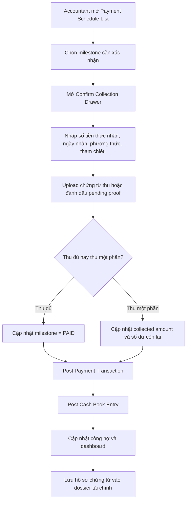
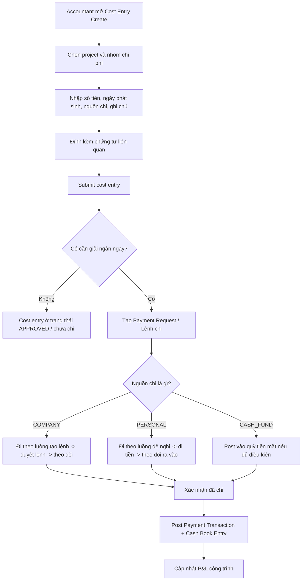
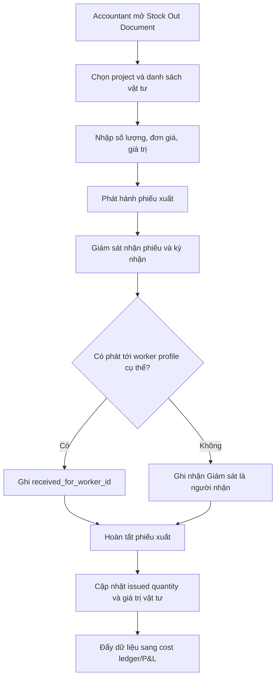
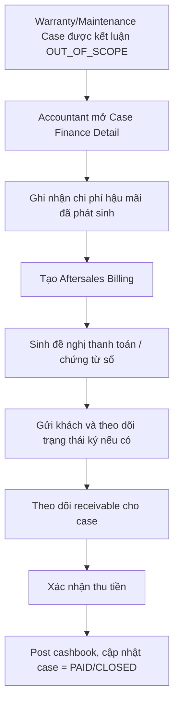
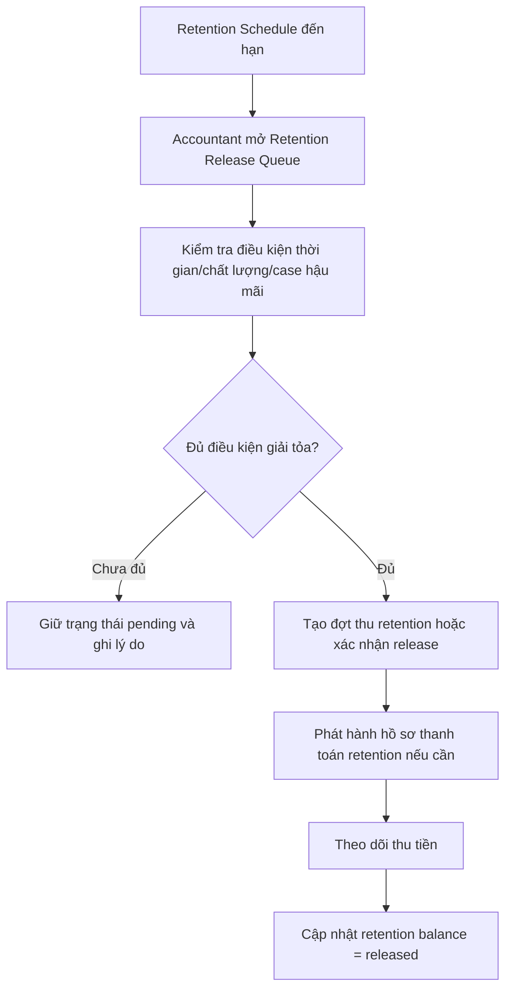
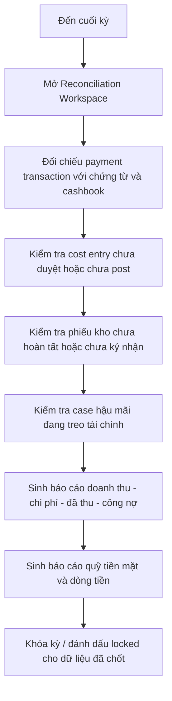

# User Flows - Accountant V4

## 1. Mục tiêu

Các flow dưới đây mô tả những hành trình nghiệp vụ bắt buộc mà Accountant phải thực hiện được trong V4, bám theo:

- đợt thanh toán hợp đồng
- chi phí công trình và lệnh chi
- sổ quỹ và nguồn tiền
- kho vật tư và ký nhận
- hậu mãi bảo hành/bảo trì
- đối soát và báo cáo tháng

## 2. Flow 1 - Xác nhận thu tiền theo đợt thanh toán

**Goal**: Accountant xác nhận thu tiền đầy đủ chứng từ và cập nhật công nợ đúng.

**Điểm kiểm soát**

- milestone gốc không được mất dấu vết khi partial payment
- chứng từ thu và audit phải link tới transaction
- nếu phát sinh overpayment phải có rule xử lý rõ

## 3. Flow 2 - Ghi nhận chi phí công trình và tạo lệnh chi

**Goal**: Mọi khoản chi thực tế đều đi qua cost ledger và approval phù hợp.

**Điểm kiểm soát**

- chi tiền phải tách được tiền công ty và tiền cá nhân
- mọi chi phí phải có project hoặc ngữ cảnh nghiệp vụ
- chi phí đã khóa kỳ không sửa trực tiếp

## 4. Flow 3 - Xuất kho và ký nhận vật tư

**Goal**: Accountant kiểm soát được vật tư ra công trình, người nhận và giá trị chi phí.

**Điểm kiểm soát**

- phase hiện tại vẫn dùng Giám sát làm actor số
- giá trị xuất kho phải đi sang cost ledger
- phiếu chưa ký nhận thì trạng thái kho và task liên quan chưa xem là hoàn tất

## 5. Flow 4 - Xử lý case bảo trì tính phí

**Goal**: Accountant theo dõi đầy đủ tài chính của case ngoài phạm vi bảo hành.

**Điểm kiểm soát**

- chi phí hậu mãi phải ghi được kể cả khi miễn phí
- billing hậu mãi là receivable riêng, không gộp mơ hồ vào hợp đồng cũ
- case chỉ đóng hoàn toàn khi kỹ thuật và tài chính đều xong

## 6. Flow 5 - Giải tỏa retention sau bảo hành

**Goal**: Accountant xử lý đúng khoản giữ lại bảo hành theo điều kiện hợp đồng.

**Điểm kiểm soát**

- retention không được tự mất khỏi dashboard chỉ vì đã qua thời gian dự kiến
- phải kiểm tra tồn tại case hậu mãi/dispute trước khi release

## 7. Flow 6 - Đối soát và chốt tháng

**Goal**: Accountant chốt kỳ báo cáo với số liệu có thể truy vết.

**Điểm kiểm soát**

- báo cáo tháng phải truy được về transaction gốc
- không khóa kỳ khi còn transaction lớn chưa post hoặc chưa duyệt
- dữ liệu locked chỉ sửa bằng adjustment/reversal

## 8. Kết luận

6 flow trên là bộ tối thiểu để role Accountant của BA-V4 vận hành được thực tế. Nếu backlog dev chỉ map được vào `Flow 1` và một phần `Flow 3`, thì hệ thống vẫn đang mới dừng ở prototype chứ chưa đạt chuẩn kiểm soát tài chính nội bộ.
