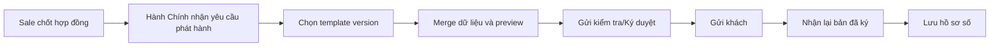
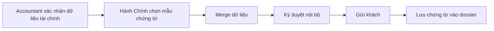
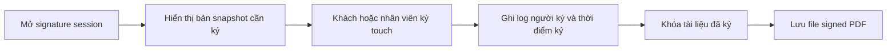
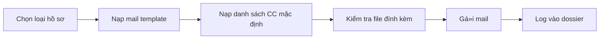
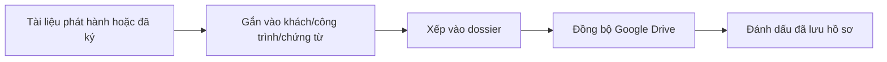
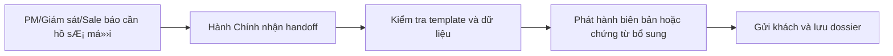

# User Flows - HanhChinh v4

## 1. Phát hành hợp đồng

## 2. Phát hành phiếu tạm ứng / đề nghị thanh toán

## 3. Ký điện tử trên thiết bị touch

## 4. Gửi mail mẫu và CC nội bộ

## 5. Lưu hồ sơ số

## 6. Hỗ trợ phát sinh và hồ sơ bổ sung

