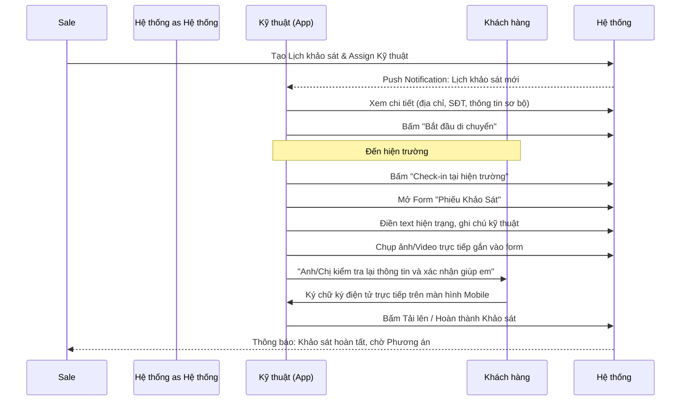
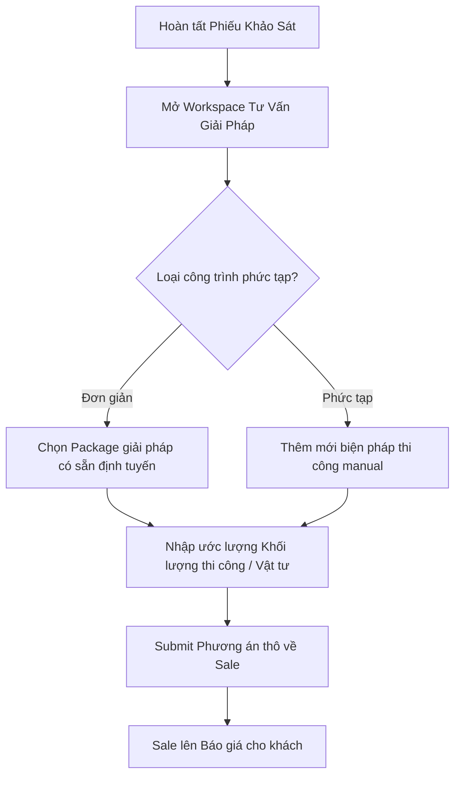
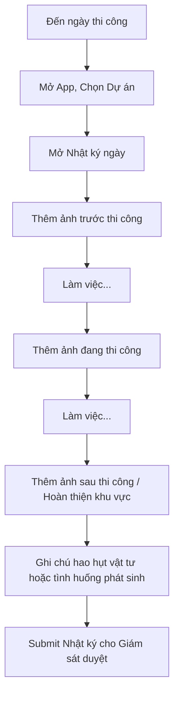
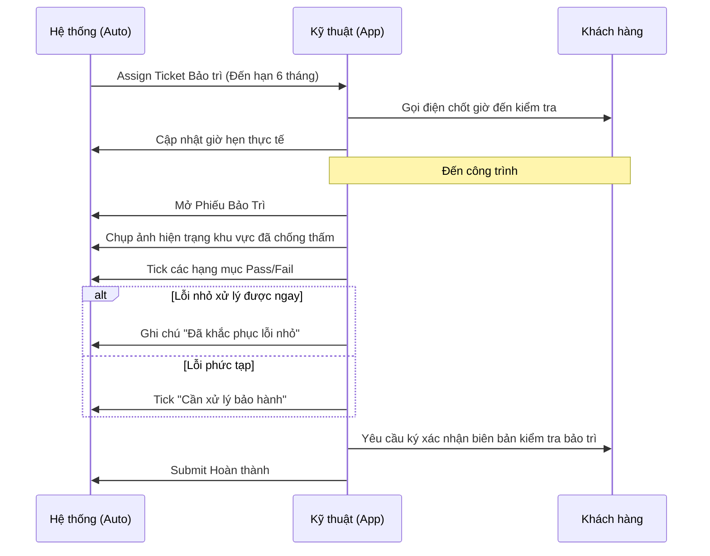

# User Flows - Kỹ Thuật (Technical) v4

## 1. Giới thiệu
Tài liệu định nghĩa các luồng thao tác (User Flows) chính yếu của người dùng có role **Kỹ thuật** thông qua hệ thống BAC Group.

## 2. User Flow: Luồng Khảo sát hiện trường (Site Survey Flow)
Đây là quy trình nền tảng nhất, chuyển đổi data từ thực địa thành cơ sở thiết kế giải pháp.

## 3. User Flow: Luồng Cung cấp Phương án kỹ thuật (Solution Consultation)
Xảy ra ngay sau khi có phiếu khảo sát.

## 4. User Flow: Luồng Báo cáo Thi công hàng ngày (Daily Execution Log)
Quy trình giúp PM và Giám sát kiểm soát công trường không cần có mặt.

## 5. User Flow: Luồng Bảo trì định kỳ (Periodic Maintenance)
Quy trình sau bán hàng (After-sales) đảm bảo chất lượng.

