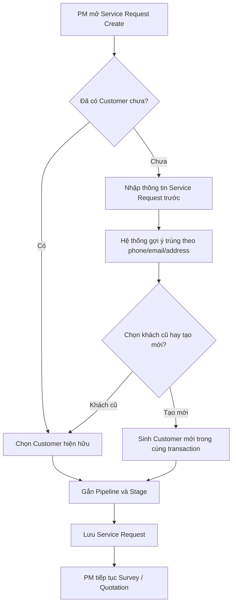
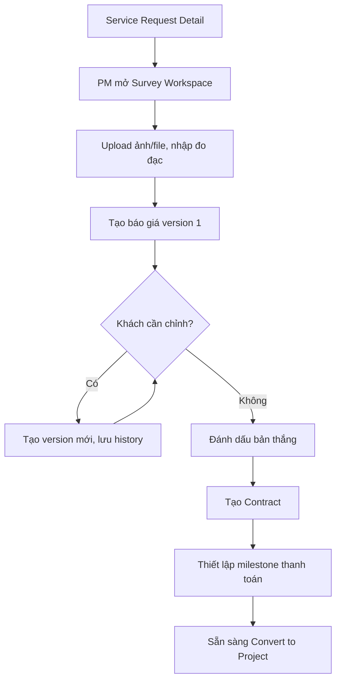
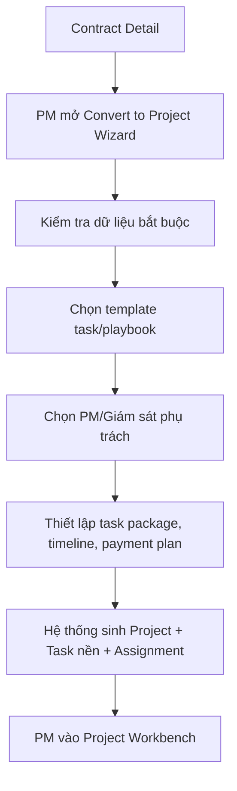
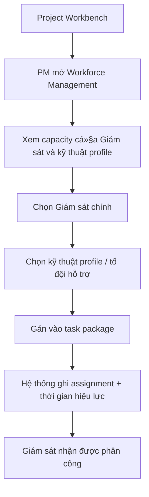
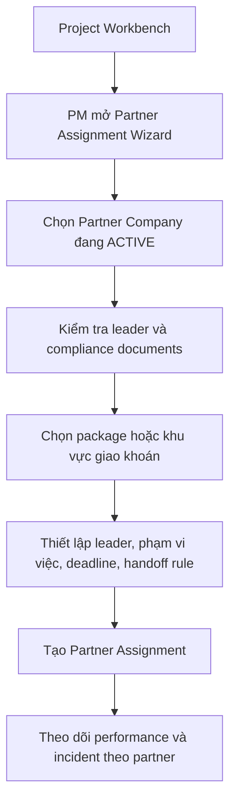
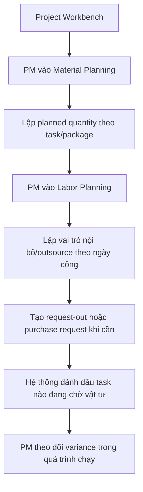
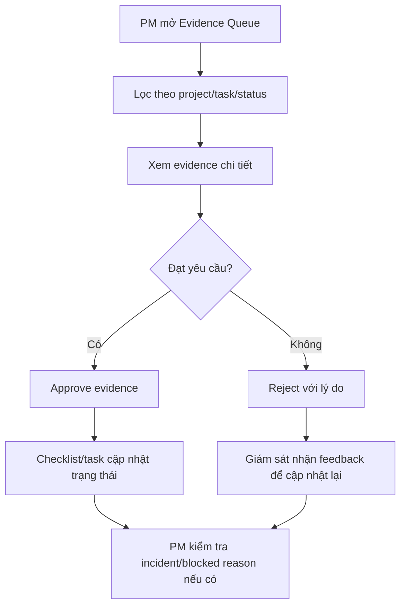
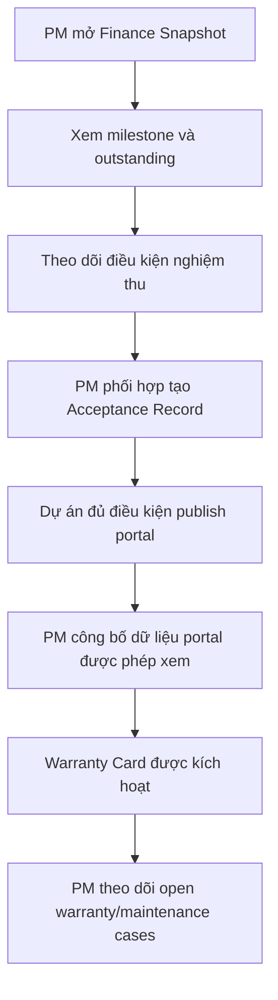

# User Flows - PM V4

## 1. Mục tiêu

Các flow dưới đây mô tả các hành trình PM bắt buộc phải làm được trong V4. Flow được viết theo mô hình mới:

- `Service Request-first`
- `Giám sát thao tác thay kỹ thuật profile`
- `Module B - Vận hành nội bộ`
- có cả `đội nội bộ` và `partner/outsource`

## 2. Flow 1 - Tạo Service Request linh hoạt

**Goal**: PM tạo lead mới mà không bị ép trình tự nhập liệu.

**Điểm kiểm soát**

- không tạo rác customer
- request phải có pipeline/stage ngay từ đầu
- activity log phải ghi rõ cách customer được gắn vào request

## 3. Flow 2 - Survey -> Quotation -> Contract

**Goal**: PM chốt đầu vào thương mại mà không mất dữ liệu khảo sát.

## 4. Flow 3 - Convert sang Project và seed vận hành nội bộ

**Goal**: Khi deal thắng, PM tạo được project đầy đủ dữ liệu nền.

## 5. Flow 4 - Quản lý đội nội bộ và phân công workforce

**Goal**: PM phân bổ nguồn lực nội bộ đúng tải và đúng kỹ năng.

## 6. Flow 5 - Gán nhà thầu liên kết/outsource

**Goal**: PM đưa đối tác liên kết vào dự án mà vẫn kiểm soát được chất lượng và trách nhiệm.

## 7. Flow 6 - Lập kế hoạch vật tư và nhân lực

**Goal**: PM khóa được planning trước khi thi công.

## 8. Flow 7 - Review evidence và xử lý ngoại lệ

**Goal**: PM giám sát từ xa thông qua evidence, incident và blocked reason.

## 9. Flow 8 - Theo dõi tài chính -> nghiệm thu -> portal -> warranty

**Goal**: PM đóng được vòng đời dự án và theo dõi hậu mãi.

## 10. Kết luận

8 flow trên là tối thiểu để PM trong V4 vận hành được thực tế. Nếu một màn hình hoặc backlog dev không map được vào một trong các flow này, cần xem lại vì rất có thể đang xây lệch scope PM.
