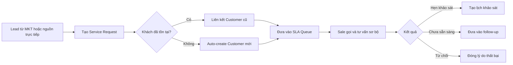
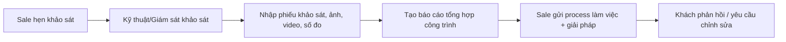
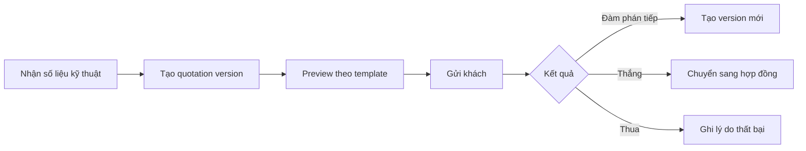
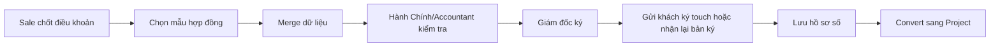
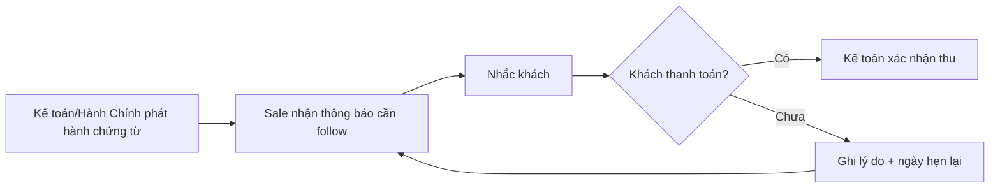
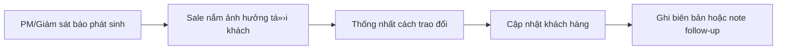
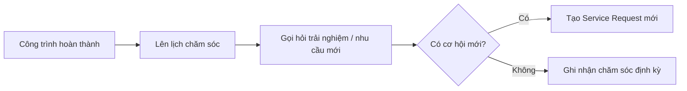

# User Flows - Sale v4

## 1. Intake và phản hồi lead

## 2. Khảo sát đến gửi giải pháp

## 3. Báo giá và chốt thắng/thua

## 4. Hợp đồng và ký điện tử

## 5. Tạm ứng và thanh toán

## 6. Phối hợp phát sinh hiện trường

## 7. Chăm sóc sau công trình và upsell

